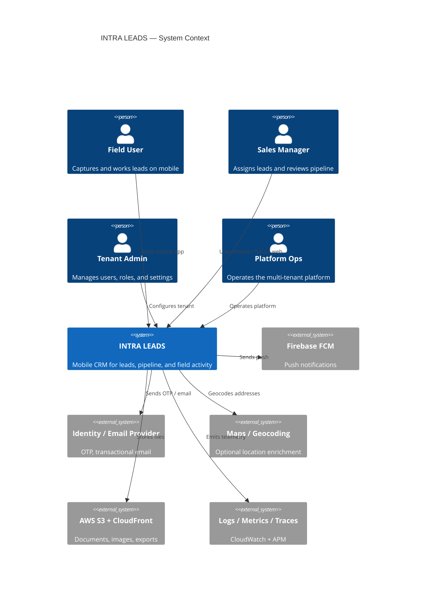
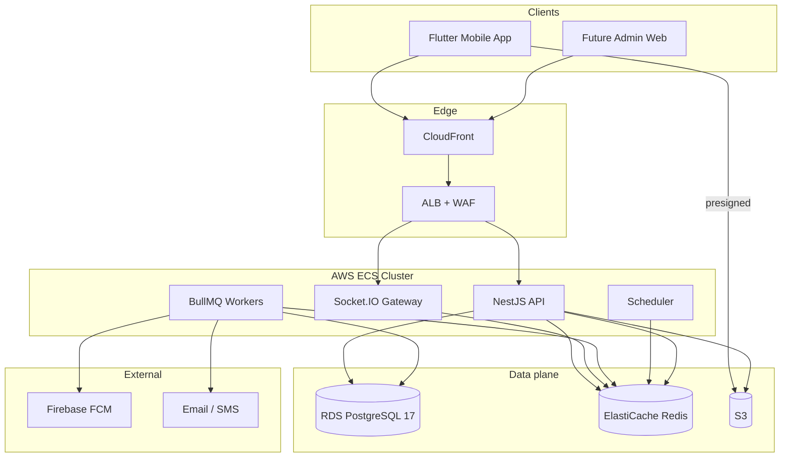
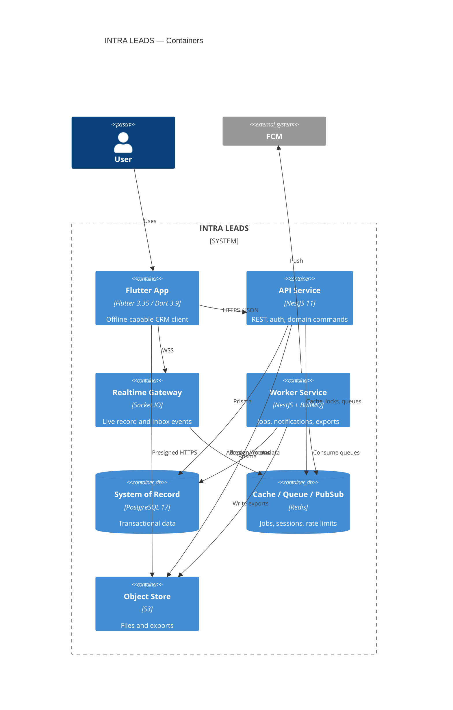
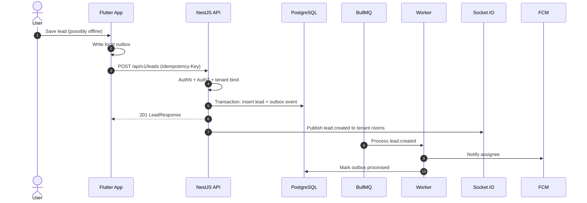
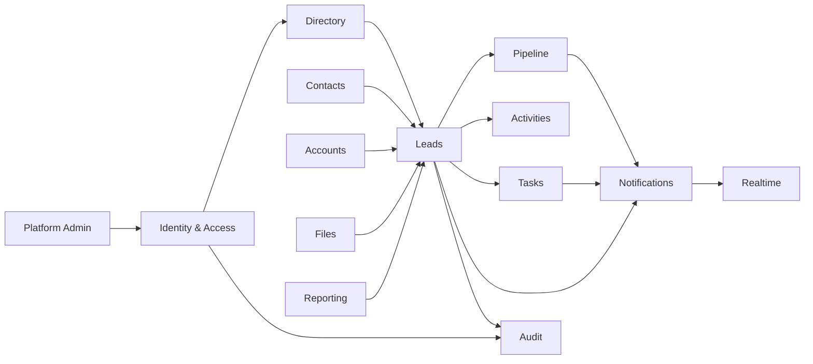
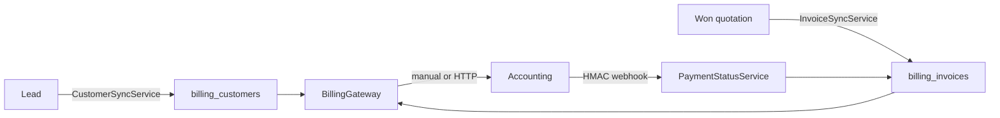
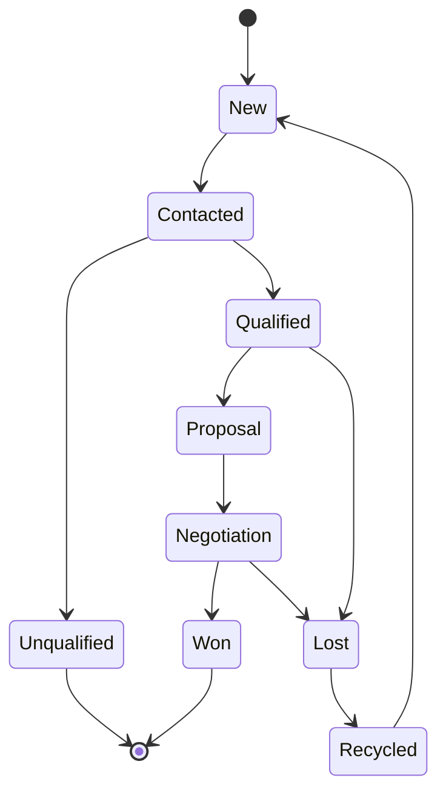
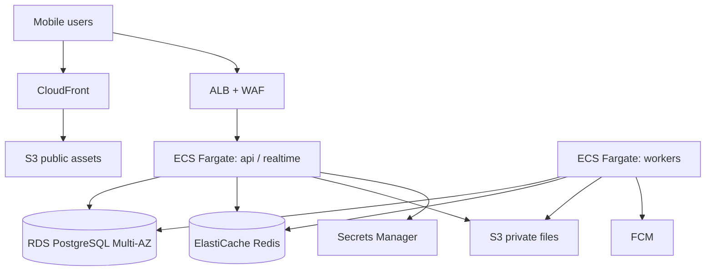
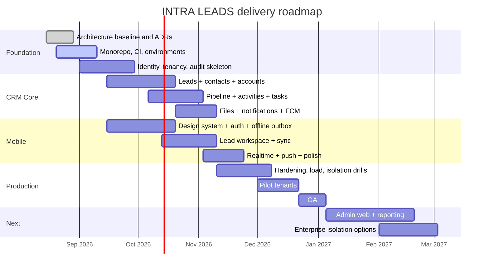

# INTRA LEADS

# Software Architecture Document (SAD)

| Field | Value |
| --- | --- |
| Product | INTRA LEADS |
| Document type | Software Architecture Document |
| Classification | Internal — Architecture |
| Version | 1.0.0 |
| Status | Approved for implementation baseline |
| Date | 15 August 2026 |
| Audience | Engineering, Product, Security, DevOps, QA, Delivery leadership |

---

## Document control

### Revision history

| Version | Date | Author | Description |
| --- | --- | --- | --- |
| 1.0.0 | 2026-08-15 | Solution Architecture | Initial enterprise SAD for INTRA LEADS |

### Related artifacts

| Artifact | Location |
| --- | --- |
| This SAD | `docs/architecture/SOFTWARE_ARCHITECTURE_DOCUMENT.md` |
| OpenAPI contract (future) | `docs/api/openapi.yaml` |
| Data model | `docs/data/LOGICAL_DATA_MODEL.md` |
| PostgreSQL schema | `docs/data/sql/intra_leads_schema.sql` |
| Runbooks (future) | `docs/operations/` |
| ADRs (future) | `docs/architecture/decisions/` |

### How to use this document

This SAD is the single source of truth for architectural intent. Implementation must conform to the standards in this document. Deviations require an Architecture Decision Record (ADR) and review.

This document does **not** contain application source code. It defines structure, contracts, constraints, and delivery sequence.

---

## 1. Executive summary

INTRA LEADS is an enterprise-grade **mobile-first CRM** for lead capture, qualification, assignment, pipeline execution, and field-sales activity. The system is designed as a **modular monolith** with explicit bounded contexts, so the product can ship quickly while remaining ready to extract services later.

The architecture prioritizes:

- Offline-capable Flutter clients for field users
- A strongly typed NestJS API with PostgreSQL as the system of record
- Asynchronous work via Redis and BullMQ
- Real-time presence and record updates via Socket.IO
- Push notifications via Firebase Cloud Messaging
- AWS-native deployment on ECS, RDS, S3, and CloudFront
- Shared-schema multi-tenancy from day one, with a path to stronger isolation

**Primary architectural style:** Modular monolith + hexagonal (ports and adapters) + event-driven side effects.

**Primary delivery posture:** Mobile CRM first, admin web later, multi-tenant SaaS readiness from the first schema.

---

## 2. Purpose, scope, and non-goals

### 2.1 Purpose

Define the target architecture, engineering standards, security baseline, scalability model, multi-tenant model, and phased roadmap for INTRA LEADS.

### 2.2 In scope

- Mobile CRM for leads, contacts, accounts, activities, tasks, and pipeline
- Authentication, authorization, tenancy, and audit
- REST API, real-time channels, push notifications, and background jobs
- File and media storage
- Click-to-call, WhatsApp, and SMS from the lead (device launch; optional Twilio / Meta gateways)
- Accounting integration: customer sync, invoice sync, and payment status (manual or HTTP adapter)
- Observability, environments, and CI/CD shape
- Folder, module, API, naming, coding, and security standards
- Scalability and multi-tenant readiness
- Development roadmap through production hardening

### 2.3 Out of scope (v1)

- Full marketing automation / drip campaigns
- Public marketplace or third-party app store
- Customer self-serve billing portal (architecture reserved, not built in Phase 1)
- On-device ML ranking as a production dependency
- Multi-region active-active write path

### 2.4 Non-goals

- Microservices on day one
- GraphQL as the primary public contract
- Direct client-to-database access
- Shared “god” modules that mix domain rules with infrastructure
- Ad-hoc REST shapes that differ per feature team

---

## 3. Stakeholders and quality attributes

### 3.1 Stakeholders

| Stakeholder | Primary concern |
| --- | --- |
| Field sales / BD executives | Fast lead capture, offline use, low-friction follow-up |
| Sales managers | Assignment, pipeline visibility, SLA adherence |
| Tenant administrators | Users, roles, territories, configuration |
| Platform / product owner | Time-to-market, extensibility, multi-tenant SaaS |
| Engineering | Clear module boundaries, testability, predictable APIs |
| Security / compliance | Isolation, PII protection, auditability |
| DevOps / SRE | Operability, cost, scale, recovery |
| QA | Deterministic contracts, environments, test data |

### 3.2 Quality attribute priorities

| Priority | Attribute | Target |
| --- | --- | --- |
| P0 | Security and tenant isolation | Zero cross-tenant data leakage |
| P0 | Reliability | API availability 99.9% monthly (production) |
| P0 | Data integrity | Strong consistency for lead ownership and stage changes |
| P1 | Mobile usability | p95 interactive API under 300 ms in-region, excluding uploads |
| P1 | Offline resilience | Safe local queue with conflict rules |
| P1 | Observability | Trace every request and job with correlation IDs |
| P2 | Scalability | Horizontal scale of API and workers independently |
| P2 | Maintainability | Feature teams can own modules without touching core |
| P3 | Portability | Cloud-native AWS, but domain layer remains cloud-agnostic |

### 3.3 Architectural constraints

- Flutter 3.35+ / Dart 3.9+ client
- NestJS 11 backend
- PostgreSQL 17 + Prisma ORM
- Redis + BullMQ for jobs and cache
- Socket.IO for realtime
- AWS ECS, RDS, S3, CloudFront
- Firebase FCM for push
- No generated application code in this document

---

## 4. System context

INTRA LEADS sits between field users, tenant operators, and a small set of external platforms.



### 4.1 External integrations

| Integration | Direction | Purpose | Failure mode |
| --- | --- | --- | --- |
| Firebase FCM | Outbound | Device push | Queue and retry; in-app inbox remains source of truth |
| Transactional email / SMS | Outbound | OTP, assignment alerts | Retry via BullMQ; never block lead writes |
| AWS S3 / CloudFront | Outbound | Attachments, avatars, exports | Presigned upload; API never proxies large binaries |
| Maps / geocoding | Outbound | Address normalization | Best-effort enrichment; lead remains valid without it |
| Observability stack | Outbound | Logs, metrics, traces | Local buffer; never fail user requests |
| Accounting / ERP | Bidirectional | Customer push; invoice + payment pull/webhooks | Manual adapter keeps a local projection; gateway failure never blocks a won quotation |

---

## 5. System architecture

### 5.1 Architecture principles

1. **Modular monolith first.** One deployable API, many isolated domain modules.
2. **Domain owns rules.** Controllers and Prisma do not contain business policy.
3. **Tenant is a first-class dimension.** Every query, job, socket room, and cache key is tenant-scoped.
4. **Synchronous for commands that must be correct.** Lead create, assign, stage change, and auth are request/response.
5. **Asynchronous for side effects.** Notifications, search index updates, exports, geocoding, and webhooks.
6. **Mobile is a first-class client.** Offline, pagination, delta sync, and idempotency are API concerns, not app hacks.
7. **Contracts before code.** OpenAPI and event catalogs govern change.
8. **Secure by default.** Deny by default, least privilege, encrypt in transit and at rest.
9. **Observable by default.** Correlation ID from device to worker.
10. **Extract later, do not rewrite.** Module boundaries must be service-extractable.

### 5.2 Logical architecture



### 5.3 C4 container view



### 5.4 Runtime services

| Service | Responsibility | Scale unit | State |
| --- | --- | --- | --- |
| `api` | REST, auth, command/query orchestration | ECS task, horizontal | Stateless |
| `realtime` | Authenticated Socket.IO rooms | ECS task, sticky or Redis adapter | Stateless + Redis adapter |
| `worker` | BullMQ processors | ECS service, queue-depth autoscaling | Stateless |
| `scheduler` | Repeatable jobs: SLA, digest, cleanup | Single active instance with lock | Stateless |
| PostgreSQL | System of record | RDS Multi-AZ | Stateful |
| Redis | Cache, queues, pub/sub, rate limit, locks | ElastiCache | Stateful |
| S3 + CloudFront | Objects and static assets | Managed | Stateful |

The API and realtime gateway may start as one NestJS process with two entrypoints, then split when connection fan-out requires it. Workers are a separate process from day one.

### 5.5 Backend layering (hexagonal)

Each NestJS domain module follows the same internal layers:

```text
Interface adapters        Application              Domain                 Infrastructure
------------------        -----------              ------                 --------------
HTTP controllers          Use cases / commands     Entities / aggregates  Prisma repositories
Socket gateways           Query handlers           Domain services        Redis adapters
Queue processors          Application services     Domain events          S3 / FCM / email
DTOs + mappers            Ports (interfaces)       Value objects          Clock / ID / crypto
Guards / pipes            Transaction boundary     Policies               Config
```

**Rules:**

- Domain layer has no Nest, Prisma, Redis, or AWS imports.
- Application layer depends on ports, not adapters.
- Infrastructure implements ports.
- Controllers translate HTTP only. They do not implement business rules.
- Prisma models are persistence models, not domain entities.

### 5.6 Frontend architecture (Flutter)

The mobile app is **feature-first**, with a thin core for networking, auth, tenancy, sync, and design system.

```text
Presentation          Application              Domain                Infrastructure
------------          -----------              ------                --------------
Screens / widgets     Notifiers / controllers  Entities / VOs        Dio / API clients
Go Router routes      Riverpod providers       Policies              Secure storage
Material 3 theme      Form / UX state          Failure types         SQLite / Drift cache
Localization          Sync coordinators        Enums                 FCM / Socket clients
```

**Client principles:**

- Riverpod is the only state and DI mechanism.
- Go Router owns navigation and deep links.
- Features never import other features’ presentation layer.
- Shared UI lives in `design_system` and `shared_widgets`.
- Offline writes go through an outbox; the server is the authority on conflict.

### 5.7 Communication patterns

| Interaction | Pattern | Transport |
| --- | --- | --- |
| CRUD and commands | Synchronous request/response | HTTPS REST JSON |
| File upload / download | Presigned URL | HTTPS to S3 / CloudFront |
| Live record changes | Pub/sub | Socket.IO over WSS |
| Push when app is backgrounded | Notification | FCM |
| Side effects | Reliable queue | BullMQ on Redis |
| Cross-module reactions | In-process domain events, then outbox | Memory + Postgres outbox |
| Cross-service (future) | Domain events | SNS/SQS or Redis streams |

### 5.8 Domain event catalog (baseline)

| Event | Producer | Consumers |
| --- | --- | --- |
| `lead.created` | Lead module | Assignment, notification, audit, search |
| `lead.assigned` | Lead module | Notification, activity, SLA |
| `lead.stage_changed` | Pipeline module | Notification, forecast, SLA |
| `activity.logged` | Activity module | Lead score, timeline |
| `task.due_soon` | Scheduler | Notification |
| `user.invited` | Identity module | Email |
| `export.requested` | Reporting module | Worker |
| `file.uploaded` | Files module | Virus scan / thumbnail worker |

In-process events are not a substitute for the transactional outbox. Any event that must not be lost is written in the same database transaction as the aggregate change.

### 5.9 Offline and sync model

Field users will lose connectivity. The client and API share these rules:

1. Every mutating request carries an **idempotency key**.
2. The client stores pending commands in a local **outbox**.
3. The server returns a **resource version** (`etag` / `updatedAt` + `version`).
4. Conflict policy is **server-wins for ownership and stage**, **merge-by-field for notes and custom fields** where safe.
5. Delta sync uses `updatedSince` + cursor, tenant-scoped, permission-filtered (`GET /sync`).
6. Attachments upload independently via presigned URLs; the lead payload stores only object keys.

**Client SQLite (Flutter `intra_leads.db` v2)**

| Table | Role |
| --- | --- |
| `offline_leads` | Encrypted lead payloads, dirty flag, sync status |
| `offline_notes` | Encrypted activity/note payloads |
| `offline_follow_ups` | Encrypted follow-up payloads |
| `id_map` | Local UUID → server UUID after first push |
| `sync_conflicts` | Resolved merges kept for the user to acknowledge |
| `outbox_commands` | Pending POST/PATCH with idempotency keys |
| `sync_cursors` | Last `updatedSince` for `GET /sync` |

**Conflict policy (applied on `STALE_VERSION`)**

- Leads: server wins `ownerMembershipId`, `lifecycleStatus`, `stageId` / `stageName`; client keeps title, customer, phone, email, city, requirement when those fields changed locally.
- Notes: append-only. Distinct IDs never collide.
- Follow-ups: completed/cancelled status is server-wins; otherwise notes concatenate and a dirty `dueAt` / title is kept.

**Sync engine**

1. Push the outbox (retry network errors; remap local IDs from create responses).
2. Pull `GET /sync?updatedSince=&limit=`.
3. Merge into SQLite without overwriting dirty local rows until the outbox flush succeeds.


### 5.10 High-level data flow — create lead



---

## 6. Technology stack

### 6.1 Approved stack

| Layer | Technology | Role |
| --- | --- | --- |
| Mobile | Flutter 3.35+, Dart 3.9+ | Client |
| State | Riverpod | DI and state |
| Routing | Go Router | Navigation, guards, deep links |
| UI | Material 3 | Design system baseline |
| API | NestJS 11 | Application platform |
| Language (API) | TypeScript 5.x, strict | Backend language |
| ORM | Prisma | Schema, migrations, typed access |
| Database | PostgreSQL 17 on RDS | System of record |
| Cache / queue | Redis + BullMQ | Cache, jobs, pub/sub, locks |
| Realtime | Socket.IO | Live updates |
| Objects | S3 + CloudFront | Files and CDN |
| Push | Firebase FCM | Device notifications |
| Compute | AWS ECS (Fargate preferred) | API, gateway, workers |
| Secrets | AWS Secrets Manager | Runtime secrets |
| Images | ECR | Container registry |
| CI | GitHub Actions or equivalent | Build, lint, test, scan |
| IaC | Terraform or AWS CDK | Environments |

### 6.2 Explicitly deferred

| Technology | Decision |
| --- | --- |
| GraphQL | Not the public contract in v1 |
| Elasticsearch / OpenSearch | Add when lead search outgrows Postgres |
| Kafka | Not required until multi-service event mesh |
| Kubernetes | ECS is the initial orchestrator |
| Multi-region writes | Single primary region first |

### 6.3 Version policy

- Pin major versions in the SAD; allow patch updates without ADR.
- Minor upgrades require regression on auth, sync, and migrations.
- Major upgrades require an ADR.

---

## 7. Folder structure

Monorepo. One repository, two primary applications, shared contracts later if a web client is added.

```text
INTRACRM/
├── apps/
│   ├── mobile/                          # Flutter 3.35+ application
│   └── api/                             # NestJS 11 application
├── packages/                            # Optional later: shared contracts, design tokens
├── infra/                               # Terraform / CDK
│   ├── environments/
│   │   ├── dev/
│   │   ├── staging/
│   │   └── prod/
│   └── modules/
├── docs/
│   ├── architecture/
│   │   ├── SOFTWARE_ARCHITECTURE_DOCUMENT.md
│   │   └── decisions/                   # ADR-0001-...
│   ├── api/
│   └── operations/
├── scripts/                             # Dev tooling, seed, release helpers
├── .github/workflows/
├── LICENSE
└── README.md
```

### 7.1 Flutter application

```text
apps/mobile/
├── lib/
│   ├── main.dart
│   ├── bootstrap.dart
│   ├── app.dart
│   ├── core/
│   │   ├── config/
│   │   ├── error/
│   │   ├── logging/
│   │   ├── network/
│   │   ├── storage/
│   │   ├── sync/
│   │   ├── realtime/
│   │   ├── push/
│   │   ├── auth/
│   │   ├── tenancy/
│   │   └── utils/
│   ├── design_system/
│   │   ├── theme/
│   │   ├── tokens/
│   │   └── components/
│   ├── l10n/
│   ├── router/
│   └── features/
│       ├── auth/
│       ├── leads/
│       ├── contacts/
│       ├── accounts/
│       ├── pipeline/
│       ├── activities/
│       ├── tasks/
│       ├── notifications/
│       ├── profile/
│       └── settings/
├── test/
├── integration_test/
├── assets/
└── pubspec.yaml
```

**Feature folder (repeatable):**

```text
features/leads/
├── application/          # Riverpod notifiers, use-case facades
├── domain/               # entities, value objects, failures
├── data/                 # DTO, mappers, API/local sources, repository impl
└── presentation/         # pages, widgets, controllers bound to UI
```

### 7.2 NestJS application

```text
apps/api/
├── src/
│   ├── main.ts
│   ├── app.module.ts
│   ├── health/
│   ├── common/                           # Cross-cutting, no domain rules
│   │   ├── auth/
│   │   ├── tenancy/
│   │   ├── logging/
│   │   ├── interceptors/
│   │   ├── filters/
│   │   ├── pipes/
│   │   ├── guards/
│   │   ├── pagination/
│   │   ├── idempotency/
│   │   └── openapi/
│   ├── modules/
│   │   ├── identity/
│   │   ├── directory/
│   │   ├── crm-leads/
│   │   ├── crm-contacts/
│   │   ├── crm-accounts/
│   │   ├── pipeline/
│   │   ├── activities/
│   │   ├── tasks/
│   │   ├── files/
│   │   ├── notifications/
│   │   ├── realtime/
│   │   ├── reporting/
│   │   ├── audit/
│   │   └── platform-admin/
│   ├── jobs/                             # Queue registration only
│   └── prisma/
├── prisma/
│   ├── schema.prisma
│   ├── migrations/
│   └── seed/
├── test/
│   ├── unit/
│   ├── integration/
│   └── e2e/
├── Dockerfile
└── package.json
```

**Backend module folder (repeatable):**

```text
modules/crm-leads/
├── crm-leads.module.ts
├── domain/
├── application/
│   ├── commands/
│   ├── queries/
│   └── ports/
├── infrastructure/
│   ├── persistence/
│   ├── queue/
│   └── mappers/
└── interface/
    ├── http/
    ├── dto/
    └── realtime/
```

### 7.3 Repository rules

- `apps/mobile` must not import `apps/api` source.
- `apps/api` modules must not import another module’s `infrastructure` or `interface` internals.
- Cross-module collaboration happens through application public facades or domain events.
- `common/` is for technical cross-cutting only.
- No circular module dependencies.

---

## 8. Module structure

### 8.1 Bounded contexts



### 8.2 Module catalog

| Module | Bounded context | Owns | Does not own |
| --- | --- | --- | --- |
| Identity & Access | Security | Users, credentials, sessions, MFA/OTP, JWT, password policy | Lead business rules |
| Directory | Organization | Tenants, branches, teams, territories, roles, memberships | Authentication |
| Catalog | Tenant master data | Products, categories, sources, lead quality, pipeline stages (lead status), warranty periods | Lead records, quotations |
| Comms | Outreach | Click-to-call, WhatsApp, SMS, message templates, optional Twilio/Meta gateways | Marketing campaigns |
| Billing | Finance integration | Customer sync, invoice sync, payment status (accounting adapter + webhooks) | Customer self-serve portal, collections posting |
| Leads | CRM core | Lead lifecycle, source, score, ownership, qualification | Stage machine definition |
| Contacts | CRM core | People, phones, emails, relationships | Account financials |
| Accounts | CRM core | Organizations, hierarchy | Lead stage |
| Pipeline | Revenue | Stages, reasons, conversion rules, forecasts snapshot | Lead master data |
| Activities | Execution | Calls, meetings, notes, visits, timeline | Task due-date engine |
| Tasks | Execution | Follow-ups, reminders, SLA clocks | Push delivery |
| Files | Content | Object metadata, virus-scan status, visibility | Binary bytes |
| Notifications | Engagement | In-app inbox, preferences, FCM dispatch commands | Socket transport |
| Realtime | Delivery | Rooms, presence, event fan-out | Persistence of CRM records |
| Reporting | Insight | Aggregations, exports, dashboards | Live operational writes |
| Audit | Compliance | Immutable activity trail | UX presentation |
| Platform Admin | Control plane | Tenant provisioning, feature flags, system users | Tenant CRM data |

### 8.3 Core CRM aggregates

| Aggregate | Root | Invariants |
| --- | --- | --- |
| Tenant | `Tenant` | Unique slug; status controls access |
| User | `User` | Belongs to one or more tenants via membership |
| Membership | `Membership` | User + tenant + roles + status |
| Lead | `Lead` | Always tenant-scoped; exactly one owner at a time unless pool-owned; stage must exist in tenant pipeline |
| Contact | `Contact` | Unique-enough identity per tenant by phone/email policy |
| Account | `Account` | Optional parent; no cross-tenant hierarchy |
| Pipeline | `Pipeline` | One default pipeline per tenant in v1 |
| Activity | `Activity` | Must attach to a visible parent record |
| Task | `Task` | Due date required for SLA tasks; assignee must be tenant member |
| FileObject | `FileObject` | Tenant + owner + key; never store raw bytes in Postgres |
| Notification | `Notification` | User + tenant scoped; delivery status independent of inbox read state |
| AuditEvent | `AuditEvent` | Append-only |
| BillingCustomer | `BillingCustomer` | One live mapping per lead; CRM owns name/phone/email |
| BillingInvoice | `BillingInvoice` | Accounting owns number, totals, and payment status |

### 8.4 Identity and authorization model

**Authentication**

- Access token: short-lived JWT (15 minutes)
- Refresh token: rotating, family-aware, stored as hash
- Device binding for mobile refresh tokens
- OTP for first login / password reset / step-up actions
- Optional SSO reserved via OIDC (not Phase 1)

**Authorization**

Two layers:

1. **RBAC** — role permissions on resources and actions
2. **Record scope** — ownership, team, territory, and tenant

Baseline roles:

| Role | Typical scope |
| --- | --- |
| `platform.super_admin` | Control plane only |
| `tenant.admin` | Tenant configuration and all tenant records |
| `sales.manager` | Team / territory records |
| `sales.executive` | Owned records + explicitly shared |
| `sales.viewer` | Read-only assigned scope |
| `api.integration` | Constrained machine access |

Permission catalog uses `resource:action` names:

```text
lead:create
lead:read
lead:update
lead:assign
lead:change_stage
lead:delete
lead:export
contact:read
billing:read
billing:sync
task:complete
tenant:manage_users
tenant:manage_settings
```

Authorization is evaluated in a single `AccessPolicy` service. Controllers never encode role names.

### 8.5 Billing integration

Accounting is a peer system, not a CRM screen. The Billing module owns the mapping; adapters never write leads or quotations directly.

| Resource | Source of truth | CRM action |
| --- | --- | --- |
| Customer | CRM lead identity (name, phone, email) | Push upsert; store `external_id` |
| Invoice | Accounting | Create from a **won** quotation; pull/webhook is canonical for number and totals |
| Payment status | Accounting | CRM never posts collections; webhook or refresh updates `payment_status` |



Default `BILLING_PROVIDER=manual` writes a local projection (`CUS-{leadNumber}`, `INV-{quotationNumber}`) so field staff can see invoices without an ERP. `http` posts to `BILLING_API_BASE_URL` and falls back to the local row with `sync_status=failed`. Winning a quotation never fails if accounting is down.

Inbound: `POST /integrations/billing/webhooks/{provider}` with `X-Billing-Signature: sha256=...` over the raw body.

### 8.6 Lead lifecycle



Stage names are tenant-configurable. The state machine is data-driven, not hardcoded in UI. Invalid transitions are rejected by the Pipeline module.

### 8.7 Module communication rules

- **Allowed:** Module A calls Module B’s application facade (`LeadsFacade.assign()`).
- **Allowed:** Module A publishes a domain event; Module B subscribes.
- **Forbidden:** Module A writes to Module B’s tables.
- **Forbidden:** Prisma client usage outside a module’s persistence adapters and approved query services.
- **Forbidden:** HTTP calls between modules in the same process.

---

## 9. API standards

### 9.1 General

- Style: REST, resource-oriented
- Protocol: HTTPS only
- Payload: JSON (`application/json`)
- Contract: OpenAPI 3.1, generated from NestJS decorators and reviewed in PR
- Versioning: URI version (`/api/v1`)
- Breaking changes: new version or additive fields only
- Time: UTC ISO-8601 with offset (`2026-08-15T11:14:00Z`)
- IDs: UUID v7 preferred (time-sortable), stored as UUID
- Language: American English for keys; user-facing text is localized in the client

### 9.2 URL conventions

```text
https://{host}/api/{version}/{resource}
https://{host}/api/{version}/{resource}/{id}
https://{host}/api/{version}/{resource}/{id}/{sub-resource}
```

Examples:

```text
POST   /api/v1/leads
GET    /api/v1/leads
GET    /api/v1/leads/{leadId}
PATCH  /api/v1/leads/{leadId}
POST   /api/v1/leads/{leadId}/assign
POST   /api/v1/leads/{leadId}/stage-changes
GET    /api/v1/leads/{leadId}/activities
GET    /api/v1/catalog
GET    /api/v1/catalog/products
GET    /api/v1/comms/capabilities
GET    /api/v1/comms/templates
GET    /api/v1/leads/{leadId}/billing
POST   /api/v1/leads/{leadId}/billing/customers/sync
POST   /api/v1/quotations/{quotationId}/billing/invoices/sync
POST   /api/v1/integrations/billing/webhooks/{provider}
POST   /api/v1/leads/{leadId}/comms/call
POST   /api/v1/leads/{leadId}/comms/whatsapp
POST   /api/v1/leads/{leadId}/comms/sms
POST   /api/v1/files/presign
GET    /api/v1/me
GET    /api/v1/health
```

**Rules:**

- Plural nouns
- Kebab-case in URLs
- No verbs in resource names except for genuine actions that are not CRUD
- Actions that change a domain invariant may be sub-resource POSTs (`/assign`, `/stage-changes`)
- No trailing slashes
- No file extensions

### 9.3 Headers

| Header | Required | Purpose |
| --- | --- | --- |
| `Authorization` | Yes, except public | `Bearer {accessToken}` |
| `X-Tenant-Id` | Yes for tenant APIs | Explicit tenant context |
| `X-Request-Id` | Recommended | Client correlation; server generates if absent |
| `X-Device-Id` | Yes for mobile | Device-bound refresh and audit |
| `Idempotency-Key` | Yes for unsafe retries | UUID per command |
| `Accept-Language` | Optional | Future server-side copy |
| `If-Match` | For concurrent updates | Resource version / ETag |

The tenant in the token must match `X-Tenant-Id`. Mismatch is `403`.

### 9.4 Standard response envelope

Success (single resource):

```json
{
  "data": {},
  "meta": {
    "requestId": "01J...",
    "timestamp": "2026-08-15T11:14:00Z"
  }
}
```

Success (collection):

```json
{
  "data": [],
  "meta": {
    "requestId": "01J...",
    "timestamp": "2026-08-15T11:14:00Z",
    "page": {
      "nextCursor": "eyJvZmZzZXQiOiJ...",
      "prevCursor": null,
      "limit": 20,
      "hasMore": true
    }
  }
}
```

Error (RFC 9457 Problem Details, wrapped consistently):

```json
{
  "error": {
    "type": "https://docs.intraleads.example/errors/validation",
    "title": "Validation failed",
    "status": 422,
    "code": "VALIDATION_ERROR",
    "detail": "Phone number is invalid.",
    "instance": "/api/v1/leads",
    "requestId": "01J...",
    "errors": [
      {
        "field": "phone",
        "code": "invalid_phone",
        "message": "Phone number is invalid."
      }
    ]
  }
}
```

No stack traces, SQL, or internal hostnames in error bodies.

### 9.5 HTTP status usage

| Status | When |
| --- | --- |
| 200 | Successful read or non-creating mutation |
| 201 | Resource created |
| 202 | Accepted for async processing (exports) |
| 204 | No body, successful delete of non-returned resource |
| 400 | Malformed request |
| 401 | Missing or invalid authentication |
| 403 | Authenticated but not allowed, including tenant mismatch |
| 404 | Resource not found **or** not visible (no existence leak) |
| 409 | Conflict, including idempotency replay mismatch and stale version |
| 422 | Semantically invalid but well-formed payload |
| 429 | Rate limited |
| 500 | Unexpected server error |
| 503 | Dependency unavailable |

### 9.6 Pagination, filtering, sorting

- Default pagination: **cursor-based**
- `limit` default 20, max 100
- Offset pagination is allowed only for admin exports and is never the mobile default
- Filter query params: `filter[status]=open&filter[ownerId]={id}`
- Sort: `sort=-updatedAt,name` (`-` = descending)
- Search: `q=` for constrained fields only
- Date ranges: `filter[createdAt][gte]=` and `[lte]=`
- Unknown filter keys are rejected (`400`), not ignored

### 9.7 Idempotency

Required for `POST` and other unsafe retries from mobile:

- Header `Idempotency-Key`
- Scoped by tenant + user + route + key
- Stored payload hash and response for a minimum of 24 hours
- Same key + different body = `409`
- Same key + same body = replay original response

### 9.8 Concurrency

- Every mutable resource exposes `version` and `updatedAt`
- Updates accept `If-Match` or `version` in the body
- Stale writes return `409` with the current resource

### 9.9 Realtime API

- Endpoint: `wss://{host}/realtime`
- Auth: access token during handshake
- Tenant and user rooms only; no public rooms
- Event name format: `lead.updated`, `notification.created`
- Payload contains resource id + version + minimal projection
- Clients refetch on gap or version mismatch
- Heartbeat and exponential reconnect are client responsibilities
- Server fan-out is permission-aware; never broadcast a record the user cannot read

### 9.10 File API

1. Client requests presign: `POST /api/v1/files/presign`
2. API validates type, size, tenant quota
3. Client uploads directly to S3
4. Client confirms: `POST /api/v1/files/{fileId}/complete`
5. Worker may scan / thumbnail
6. Download uses CloudFront signed URLs, never public buckets for private CRM files

### 9.11 Versioning and deprecation

- Additive fields are compatible
- Field rename, type change, or meaning change is breaking
- Deprecated fields remain at least one minor release and are marked in OpenAPI
- `/api/v2` is introduced only when v1 cannot evolve additively

---

## 10. Naming standards

### 10.1 General

| Item | Convention | Example |
| --- | --- | --- |
| Product | INTRA LEADS | — |
| Repo | `INTRACRM` | — |
| Services | kebab-case | `intra-leads-api` |
| ECS cluster | kebab-case | `intra-leads-prod` |
| Packages | kebab-case | `intra-leads-api` |
| Env vars | SCREAMING_SNAKE | `DATABASE_URL` |
| Feature flags | dot.case | `leads.offlineSync` |

### 10.2 Dart / Flutter

| Item | Convention | Example |
| --- | --- | --- |
| Files | snake_case | `lead_list_page.dart` |
| Classes | PascalCase | `LeadListPage` |
| Members | camelCase | `assignedTo` |
| Constants | camelCase or SCREAMING_SNAKE for compile-time | `defaultPageSize` |
| Riverpod providers | camelCase + `Provider` | `leadListControllerProvider` |
| Enums | PascalCase type, camelCase values | `LeadStatus.qualified` |
| Routes | kebab-case paths | `/leads/:leadId` |
| Feature folders | snake_case | `features/leads` |

### 10.3 TypeScript / NestJS

| Item | Convention | Example |
| --- | --- | --- |
| Files | kebab-case | `assign-lead.handler.ts` |
| Classes | PascalCase | `AssignLeadHandler` |
| Methods / vars | camelCase | `assignLead` |
| Interfaces | PascalCase, no `I` prefix | `LeadRepository` |
| DTOs | PascalCase + `Dto` / `Request` / `Response` | `CreateLeadRequest` |
| Modules | kebab-case folder, PascalCase class | `CrmLeadsModule` |
| Tokens / injection | Symbol or string const | `LEAD_REPOSITORY` |
| Enums | PascalCase, SCREAMING_SNAKE values | `LeadStatus.QUALIFIED` |

### 10.4 Database and Prisma

| Item | Convention | Example |
| --- | --- | --- |
| Tables | snake_case, plural | `leads` |
| Columns | snake_case | `owner_id` |
| Primary key | `id` | UUID |
| Foreign keys | `{entity}_id` | `tenant_id` |
| Timestamps | `created_at`, `updated_at`, `deleted_at` | timestamptz |
| Indexes | `idx_{table}_{cols}` | `idx_leads_tenant_id_updated_at` |
| Unique | `uq_{table}_{cols}` | `uq_memberships_tenant_id_user_id` |
| Prisma models | PascalCase singular | `Lead` |
| Prisma fields | camelCase mapped to snake_case | `ownerId @map("owner_id")` |
| Enums in DB | snake_case type names | `lead_status` |

### 10.5 API JSON

| Item | Convention | Example |
| --- | --- | --- |
| Properties | camelCase | `ownerId` |
| Booleans | adjective / `is` / `has` | `isQualified`, `hasMore` |
| Collections | plural | `leads` |
| Identifiers | `{resource}Id` in nested objects | `accountId` |
| Enums | camelCase or stable tokens | `qualified` |
| Money | integer minor units + currency | `amountMinor`, `currency` |

JSON enums are camelCase strings. Database enums may be uppercase internally but are mapped at the API boundary.

### 10.6 Queues, events, cache

| Item | Convention | Example |
| --- | --- | --- |
| Queue name | `{env}.intra.{domain}.{action}` | `prod.intra.notifications.send-push` |
| Job name | kebab-case | `send-push` |
| Domain event | `{aggregate}.{past_tense}` | `lead.assigned` |
| Cache key | `{env}:{tenantId}:{area}:{id}` | `prod:{tid}:lead:{id}` |
| Socket room | `tenant:{id}:user:{id}` or `tenant:{id}:lead:{id}` | — |
| Metric | `intra_leads_{area}_{name}` | `intra_leads_api_request_duration_seconds` |

### 10.7 Tests

| Item | Convention | Example |
| --- | --- | --- |
| Dart unit | `{name}_test.dart` | `lead_mapper_test.dart` |
| Nest unit | `{name}.spec.ts` | `assign-lead.handler.spec.ts` |
| Nest e2e | `{name}.e2e-spec.ts` | `leads.e2e-spec.ts` |
| Test names | behavior sentence | `rejects assignment outside tenant` |

---

## 11. Coding standards

### 11.1 Cross-cutting engineering rules

1. No business rule in controllers, widgets, or Prisma middleware beyond tenancy/soft-delete enforcement.
2. Every public API has a test at the use-case or e2e level.
3. Fail closed. Missing tenant, role, or version is an error.
4. No `any` in TypeScript. No implicit `dynamic` leaks in Dart public APIs.
5. No secrets in source, logs, or crash reports.
6. Dependencies are added only with a justification in the PR.
7. Dead code is deleted, not commented.
8. Comments explain *why*, never restate the code.
9. Feature flags protect incomplete behavior. Do not ship half-wired modules silently.

### 11.2 TypeScript / NestJS

- `strict` TypeScript. `noImplicitOverride`, `noUncheckedIndexedAccess`, `exactOptionalPropertyTypes` enabled.
- ESLint + Prettier. No commit without lint in CI.
- Prefer constructor injection. No service locators.
- One command or query per handler.
- Validate all input with DTO classes + whitelist. Forbid non-whitelisted properties.
- Use transactions for multi-table writes and outbox inserts.
- Repository methods are intention-revealing: `findAssignableById`, not `findOne`.
- Soft delete is the default for CRM records. Hard delete is an explicit compliance action.
- Logging uses structured JSON. Include `requestId`, `tenantId`, `userId`, `module`.
- Never log tokens, passwords, OTPs, or raw PII beyond the minimum required for support.
- Date handling is UTC only in the API.

### 11.3 Prisma

- Schema is the source of truth for persistence.
- Expand-and-contract migrations only. No destructive migration in the same release that removes a still-used column.
- Every tenant table has `tenant_id NOT NULL` unless it is a platform table.
- Composite indexes start with `tenant_id` for tenant-scoped queries.
- No raw SQL in controllers. Raw SQL is allowed in repositories when Prisma cannot express the query, and must be reviewed.
- Prisma middleware / client extension enforces tenant predicate for tenant-scoped models.
- Seeds are deterministic and environment-gated.

### 11.4 Dart / Flutter

- `flutter analyze` is clean in CI. Prefer `very_good_analysis` or equivalent strict lints.
- Immutable domain entities. Use `freezed` or equivalent only if the team standardizes on it; do not mix several immutable libraries.
- Riverpod code generation is allowed; generated files are not hand-edited.
- Presentation depends on application/domain, never the reverse.
- Navigation is declarative via Go Router. No ad-hoc `Navigator` for feature flows except dialogs.
- All user-visible strings are localized.
- Network and database I/O never occur directly in widgets.
- Errors are typed (`Failure`) and mapped to UX once.
- Golden tests for design-system components. Widget tests for critical flows: login, create lead, assign, offline retry.
- App flavors: `dev`, `staging`, `prod`. No production endpoints in debug builds by accident.

### 11.5 Testing strategy

| Layer | Backend | Mobile | Gate |
| --- | --- | --- | --- |
| Unit | Domain + handlers | Mappers, notifiers, policies | PR |
| Integration | Prisma + Redis test containers | Local DB / outbox | PR |
| Contract | OpenAPI + e2e | Golden request fixtures | PR |
| E2E | Auth, lead lifecycle, tenancy isolation | Critical journeys | Main / release |
| Load | Lead list, assign, sync | — | Pre-prod |
| Security | AuthZ matrix, tenant isolation suite | Secure storage | Release |

**Mandatory isolation tests:**

- User A in Tenant 1 cannot read Tenant 2 by IDOR
- Manager cannot assign outside territory
- Worker jobs cannot process a job with a mismatched tenant payload
- Socket subscriber does not receive unauthorized rooms

### 11.6 Git and review

- Trunk-based or short-lived feature branches
- Conventional Commits: `feat`, `fix`, `docs`, `refactor`, `test`, `chore`, `perf`, `security`
- PR must include: intent, risk, test evidence, migration notes
- Architecture-impacting PRs require SAD or ADR update
- No force-push to `main`
- Secrets scanning on every push

### 11.7 Configuration

| Environment | Purpose | Data |
| --- | --- | --- |
| local | Developer machines | Synthetic |
| dev | Shared integration | Synthetic |
| staging | Pre-production | Anonymized / synthetic |
| prod | Production | Live tenant data |

Configuration is injected. Never branch business logic on environment name except for telemetry sampling and seed enablement.

---

## 12. Security standards

### 12.1 Security principles

- Zero trust between client and API
- Least privilege for users, roles, and AWS IAM
- Defense in depth: WAF, authn, authz, tenancy, validation, encryption
- Secure defaults
- Assume mobile devices are hostile and losable
- Audit every privileged action

### 12.2 Identity and session security

- Hash passwords with Argon2id
- Hash refresh tokens and OTPs at rest
- Rotate refresh tokens; reuse detection revokes the token family
- Lockout / backoff on failed OTP and password attempts
- Access tokens are not stored in SharedPreferences plaintext; use secure storage
- Logout revokes refresh family and device session
- Step-up authentication for export, role change, and tenant billing actions
- JWT signing keys from Secrets Manager; key rotation plan required before production

### 12.3 Tenant isolation

- Tenant ID is never taken from the body as the sole source of truth
- Effective tenant = intersection of token membership and `X-Tenant-Id`
- Every repository query includes tenant predicate
- Cache keys, job payloads, and socket rooms include tenant ID
- Integration tests attempt cross-tenant IDOR on every new resource
- Platform admins use a separate control-plane API, not tenant data APIs with a bypass flag

### 12.4 Input / output protection

- Whitelist DTO validation
- Max body size enforced at ALB and Nest
- File type allowlist and size caps
- Presigned uploads restricted by content type and key prefix `tenants/{tenantId}/...`
- Output encoding handled by Flutter widgets; API does not return HTML
- No server-side template rendering for CRM pages in v1

### 12.5 Transport and network

- TLS 1.2+ everywhere
- HSTS at the edge
- WAF on ALB
- Private subnets for ECS tasks, RDS, and Redis
- RDS and Redis not publicly reachable
- Security groups: ALB → API/realtime only; API → RDS/Redis/S3 only
- CloudFront for public assets and future web; private files via signed URLs

### 12.6 Encryption and secrets

- RDS encryption at rest
- S3 SSE-S3 or SSE-KMS for tenant files
- Redis AUTH + in-transit encryption
- Field-level encryption reserved for national IDs and secrets if collected
- Secrets Manager for `DATABASE_URL`, JWT keys, FCM, SMTP
- Rotation without redeploy for DB credentials where supported
- No long-lived AWS keys on devices

### 12.7 Privacy and data handling

- Collect minimum PII needed to work a lead
- Phone and email are PII; access is audited
- Soft-deleted records remain tenant-scoped and permissioned
- Tenant data export and deletion are roadmap items; schema must not block them
- Production data is not copied to local machines
- Logs redact phone, email, and tokens

### 12.8 Mobile security

- Certificate pinning is enforced when `SSL_PINS` is set (SHA-256 of the server certificate DER). Cleartext HTTP is allowed only in `dev`.
- Root (Android) and jailbreak (iOS) detection runs at launch. Staging and production refuse to start on a compromised device. Detection is not the only control.
- Local cache and outbox payloads are encrypted at rest with AES-256-GCM. The key lives in platform secure storage.
- Sessions are device-bound: access tokens carry `did`, and `X-Device-Id` must match `auth_sessions.device_id`.
- Biometric unlock for session resume
- Screenshot policy configurable per tenant for sensitive screens
- Deep links validate host and auth state
- FCM tokens are user+device scoped and rotated on logout

### 12.9 Abuse and rate limiting

| Channel | Limit guidance |
| --- | --- |
| Auth / OTP | Strict per phone/email/IP |
| Write APIs | Per user + tenant |
| Read APIs | Per user + tenant |
| Presign | Per user + tenant quota |
| Socket connects | Per user + device |
| Exports | Low rate, async only |

Respond with `429` and `Retry-After`.

Redis sliding counters:

| Class | Default | Key |
| --- | --- | --- |
| Auth login / forgot / reset | 10 / 15 min (dedicated) | email + IP |
| Other `/auth/*` (refresh) | `RATE_LIMIT_AUTH` / window | user or IP |
| Writes | `RATE_LIMIT_WRITE` / window | user or IP |
| Reads | `RATE_LIMIT_READ` / window | user or IP |
| Exports | `RATE_LIMIT_EXPORT` / window | user or IP |

Health checks are skipped. Redis outage fails open so the API stays available.

### 12.10 Audit and forensics

Audit events are append-only and include:

- `actorId`, `actorType`, `tenantId`, `action`, `resourceType`, `resourceId`
- before/after summary for privileged changes
- `requestId`, `deviceId`, IP, user agent
- timestamp UTC

Retained per compliance policy. Not editable via product APIs.

### 12.11 Dependency and supply chain

- Lockfiles committed
- SCA in CI (npm audit / Dependabot / equivalent)
- Container image scanning
- Flutter and npm packages from trusted registries only
- No unsigned third-party scripts in the mobile app

### 12.12 Threat model (baseline)

| Threat | Mitigation |
| --- | --- |
| Stolen device | Secure storage, short access TTL, remote session revoke |
| Token theft | Rotation, device binding, TLS |
| IDOR / tenant leak | Mandatory tenant predicate + isolation tests |
| Privilege escalation | Central policy, no client-supplied roles |
| Job injection | Signed/validated payloads, tenant checks in workers |
| Malicious upload | Type/size allowlist, key prefix, scan worker |
| Insider abuse | Audit, least privilege, control-plane separation |
| Dependency compromise | Pinning, SCA, image scan |

---

## 13. Scalability strategy

### 13.1 Scale philosophy

Scale the bottleneck, not the architecture. Start with a modular monolith and split processes when metrics demand it.

Order of scale:

1. Vertical RDS + correct indexes
2. Horizontal API tasks
3. Separate realtime and workers
4. Read replicas for reporting
5. Search engine if list/search latency degrades
6. Extract a module to a service only after a clear ownership and load reason

### 13.2 Capacity model (initial production)

| Component | Starting shape | Scale trigger |
| --- | --- | --- |
| API | 2+ Fargate tasks, Multi-AZ | CPU 60% or p95 latency |
| Realtime | Co-located, then split | Connection count / memory |
| Workers | 1–n per queue | Queue latency / depth |
| RDS | Multi-AZ, provisioned or Aurora later | Connections, IOPS, CPU |
| Redis | HA, persistence as required by queues | Memory, evictions, queue backlog |
| S3 | Unlimited objects | Cost and lifecycle only |
| CloudFront | Global read | Cache hit ratio |

### 13.3 Database strategy

- PostgreSQL 17 is the system of record
- Indexes designed for tenant-first access paths
- Hot tables: `leads`, `activities`, `audit_events`, `notifications`
- Partitioning candidates: `audit_events`, `notifications`, `domain_outbox` by month
- Read replica for reporting and heavy exports
- Connection pooling via Prisma + RDS Proxy if connection count becomes the limit
- No unbounded `SELECT *` list endpoints
- List queries are covering-index friendly: tenant + status + updated_at + id

### 13.4 Caching strategy

| Data | Cache | TTL | Invalidation |
| --- | --- | --- | --- |
| User + membership + permissions | Redis | Short | On role/membership change |
| Tenant config / pipeline | Redis | Medium | On admin update |
| Lead detail | Optional | Very short | On write |
| Idempotency records | Redis or Postgres | 24h+ | TTL |
| Rate limit counters | Redis | Window | TTL |

Do not cache authorization-sensitive lists without a permission hash in the key.

### 13.5 Queue strategy

Separate queues by failure domain:

- `notifications`
- `search-or-enrichment`
- `exports`
- `files`
- `outbox-relay`

Rules:

- Jobs are idempotent
- Payloads contain IDs, not large documents
- Poison messages go to a dead-letter queue
- Retries use exponential backoff
- Workers are independently scalable

### 13.6 Realtime strategy

- Redis adapter for Socket.IO so any gateway task can fan out
- Room granularity: user inbox, team board, single open record
- Do not stream full aggregates; send invalidation + version
- Backpressure: drop presence noise before dropping lead events
- Split realtime process when WebSocket memory dominates API tasks

### 13.7 Mobile scale

- Cursor pagination everywhere
- Delta sync windows, not full dumps
- Image thumbnails via CloudFront
- Batch inbox reads
- Avoid chatty N+1 screen APIs; provide screen-oriented query endpoints where needed (`GET /leads/{id}/workspace`)

### 13.8 Autoscaling and resilience

- ECS service autoscaling on CPU, memory, and worker queue depth
- Multi-AZ for API, RDS, Redis
- Health checks: `/health/live`, `/health/ready`
- Ready fails if PostgreSQL or Redis is down
- Circuit breakers around FCM, email, maps
- Timeouts on all outbound calls
- Graceful shutdown: stop accepting, drain requests, pause workers
- RPO / RTO targets: RPO ≤ 15 minutes (RDS backups + WAL), RTO ≤ 4 hours for regional failure in v1

### 13.9 Performance budgets

| Operation | Budget |
| --- | --- |
| Auth token issue | p95 < 200 ms |
| Lead create | p95 < 300 ms |
| Lead list (20 rows) | p95 < 300 ms |
| Lead detail | p95 < 250 ms |
| Assign lead | p95 < 300 ms |
| Sync delta | p95 < 500 ms for typical window |
| Export accept | p95 < 200 ms (async) |

Budgets exclude client-to-edge network.

---

## 14. Multi-tenant readiness

### 14.1 Tenancy model

**Phase 1 (launch):** Shared application, shared database, shared schema, `tenant_id` on every tenant-owned row.

**Phase 2 (enterprise option):** Dedicated schema or dedicated database for tenants that require stronger isolation, behind the same application ports.

The domain and repository ports must not assume that all tenants share one table. Isolation is implemented behind the persistence port.

### 14.2 Tenant dimensions

| Dimension | Rule |
| --- | --- |
| Data | Row-level `tenant_id` + repository enforcement |
| Identity | Memberships; a person may belong to multiple tenants |
| Configuration | Per-tenant pipelines, sources, fields, branding |
| Limits | Per-tenant quotas: users, storage, API rate |
| Features | Flagged per tenant |
| Encryption | Shared KMS in Phase 1; per-tenant key optional later |
| Branding | App name/theme remote-config later; not a separate binary |

### 14.3 Tenant context lifecycle

1. User authenticates
2. If one membership, it becomes default
3. If many, client selects tenant
4. Every request sends `X-Tenant-Id`
5. Guard loads membership and permissions into `TenantContext`
6. Prisma extension applies tenant predicate
7. Jobs serialize `tenantId` from context, never from untrusted job user input alone
8. Realtime join checks membership before room subscription

### 14.4 Isolation checklist

A module is not done until all are true:

- [ ] Table has `tenant_id` or is explicitly platform-scoped
- [ ] Unique constraints include `tenant_id` where business uniqueness is per tenant
- [ ] Indexes start with `tenant_id` for tenant queries
- [ ] Repository requires `TenantContext`
- [ ] Cache key includes tenant
- [ ] Queue payload includes tenant and worker re-validates
- [ ] Socket room is tenant-prefixed
- [ ] S3 key is tenant-prefixed
- [ ] Audit row includes tenant
- [ ] Cross-tenant test exists

### 14.5 Shared vs isolated resources

| Resource | Shared | Isolation mechanism |
| --- | --- | --- |
| ECS services | Yes | AuthZ + tenant context |
| PostgreSQL instance | Yes (Phase 1) | `tenant_id` + RLS candidate |
| Redis | Yes | Key prefix |
| S3 bucket | Yes | Prefix + policy |
| CloudFront | Yes | Signed URLs |
| FCM project | Yes | Topic/token per device, not per tenant broadcast |
| Logs | Yes | `tenantId` field; access controlled |

### 14.6 PostgreSQL Row Level Security (readiness)

RLS is not mandatory on day one if the Prisma extension and repository tests are strict, but the schema must be RLS-ready:

- `tenant_id` present and indexed
- No cross-tenant foreign keys
- Platform tables clearly separated
- A future `SET LOCAL app.tenant_id` policy can be added without remodel

Enable RLS before onboarding tenants with contractual isolation requirements.

### 14.7 Noisy-neighbor controls

- Per-tenant rate limits
- Per-tenant export concurrency = 1
- Per-tenant storage quota
- Query timeouts
- Worker fair scheduling if a tenant floods a queue
- Pagination max enforced server-side

### 14.8 Tenant lifecycle

| State | Meaning |
| --- | --- |
| `provisioning` | Resources being created |
| `active` | Normal use |
| `suspended` | Auth blocked except tenant admin billing/support |
| `offboarding` | Export + deletion workflow |
| `closed` | Terminal; data retained only per legal policy |

Provisioning is idempotent and performed by the Platform Admin module + jobs.

### 14.9 Custom fields (SaaS readiness)

Do not add arbitrary columns per tenant.

v1 approach:

- Well-known core fields on `leads`, `contacts`, `accounts`
- `custom_fields` JSONB with a tenant-defined schema registry
- Indexed expression or sidecar table only for fields that must be filtered

This keeps the schema stable while allowing tenant-specific CRM attributes.

---

## 15. Deployment architecture

### 15.1 AWS topology



- Public subnets: ALB, NAT
- Private subnets: ECS tasks, RDS, Redis
- Separate AWS accounts or strong account isolation for prod vs non-prod preferred

### 15.2 Environments

| Environment | Account posture | Data | Promotion |
| --- | --- | --- | --- |
| dev | Shared non-prod | Synthetic | Merge to develop |
| staging | Prod-like | Synthetic / anonymized | Release candidate |
| prod | Isolated | Live | Tagged release |

### 15.3 CI/CD shape

Implemented under `.github/workflows` (`ci.yml`, `cd.yml`, `security.yml`) and `infra/environments/{dev,staging,prod}`. See `docs/operations/DEPLOYMENT.md`.

1. Lint, typecheck, unit tests
2. Mobile analyze + widget tests
3. API integration tests with Postgres + Redis
4. Tenant isolation suite
5. SAST / SCA / image scan
6. Build and push images / Flutter artifacts
7. Apply ordered SQL (`apply-sql` ECS task; expand-only)
8. Deploy ECS services
9. Smoke health + auth + create-lead
10. Tag release

Mobile store submission is a controlled release, not every merge.

### 15.4 Configuration and secrets

- Non-secret config: environment variables / SSM
- Secrets: Secrets Manager
- Feature flags: database or managed flag service, tenant-aware
- Flutter: dart-define / flavor config; no secret API keys in the client beyond what the platform requires (FCM)

### 15.5 Observability

| Signal | Standard |
| --- | --- |
| Logs | Structured JSON to CloudWatch |
| Metrics | RED + queue depth + RDS + Redis |
| Traces | OpenTelemetry across API and workers |
| Correlation | `X-Request-Id` propagated to jobs as `correlationId` |
| Alerts | Error rate, p95, 5xx, queue lag, replica lag, DLQ |

Golden dashboards: API, workers, tenancy errors, auth failures, FCM failures.

### 15.6 Backup and recovery

- RDS automated backups + PITR
- Redis: treat as disposable except queue durability; use BullMQ settings that survive restart
- S3 versioning on private buckets
- Document restore drill twice a year
- Outbox table is in PostgreSQL and is backed up with the database

---

## 16. Development roadmap

The roadmap is capability-based. Dates are indicative sequencing, not a commercial commitment.



### Phase 0 — Architecture and platform spine

**Objective:** Make the system safe to build on.

- SAD accepted (this document)
- ADR process opened
- Monorepo layout, lint, CI
- ECS/RDS/Redis/S3 scaffolding for dev
- Observability baseline
- OpenAPI skeleton
- Coding and PR templates

**Exit criteria:** Empty API deploys, health checks pass, logs and traces visible.

### Phase 1 — Identity, tenancy, audit

**Objective:** No CRM feature ships before isolation exists.

- Signup/invite, login, refresh, logout, OTP
- Tenant, membership, RBAC
- TenantContext + Prisma tenant extension
- Audit event writer
- Rate limits on auth
- Isolation test harness

**Exit criteria:** Cross-tenant IDOR tests pass; session revoke works; audit records privileged auth events.

### Phase 2 — CRM core

**Objective:** Work a lead end to end.

- Leads CRUD, assignment, sources
- Contacts and accounts
- Pipeline definition and stage changes
- Activities and timeline
- Tasks and due dates
- Idempotency and versioning
- Cursor list APIs

**Exit criteria:** A manager can assign a lead; an executive can update stage and log an activity; all writes are tenant-safe.

### Phase 3 — Files, notifications, realtime

**Objective:** Field-usable collaboration.

- Presigned uploads
- In-app inbox
- FCM push
- Socket.IO record and inbox events
- Preference center (basic)

**Exit criteria:** Assignment notifies the assignee in-app and via push; open lead detail live-updates on stage change.

### Phase 4 — Mobile production quality

**Objective:** The Flutter client is the product.

- Material 3 design system
- Auth and tenant switch
- Offline outbox and conflict UX
- Delta sync
- Lead workspace screens
- Deep links
- Crash/analytics hygiene
- Flavors and store pipeline

**Exit criteria:** Critical journeys work offline and recover; p95 budgets met in staging; no secret leakage in client builds.

### Phase 5 — Production hardening and GA

**Objective:** Operate it.

- Load test lead list/assign/sync
- WAF, backups, restore drill
- DLQ handling
- On-call runbooks
- Security review
- Pilot tenants
- GA

**Exit criteria:** SLO dashboards live; restore drill documented; isolation and security checklists signed.

### Phase 6 — Platform expansion

**Objective:** Grow without breaking the core.

- Admin web (same API)
- Reporting and exports at scale
- Custom fields UI
- SSO/OIDC
- Per-tenant RLS or dedicated DB option
- Search engine if required
- Marketplace/webhooks

### 16.1 Definition of done (every feature)

A feature is not done until it has:

1. Domain rules in the owning module
2. OpenAPI documented endpoints
3. Tenant isolation tests
4. Audit for privileged mutations
5. Idempotency if the mobile client may retry
6. Indexes for the new access path
7. Structured logs and at least one useful metric
8. Mobile UX or an explicit API-only ADR
9. Feature flag if incomplete
10. SAD/ADR update if it changes a standard

### 16.2 Suggested team topology

| Stream | Owns |
| --- | --- |
| Platform | Identity, tenancy, CI/CD, observability |
| CRM | Leads, contacts, accounts, pipeline |
| Execution | Activities, tasks, files, notifications |
| Mobile | Flutter app, sync, design system |
| Enablement | Reporting, admin web, flags |

Streams integrate through contracts and events, not shared tables.

---

## 17. Risks and mitigations

| Risk | Impact | Mitigation |
| --- | --- | --- |
| Premature microservices | Slow delivery, distributed complexity | Modular monolith until a module’s scale or ownership forces extraction |
| Tenant leakage | Trust failure | TenantContext, Prisma extension, RLS-ready schema, mandatory isolation tests |
| Offline conflicts | Lost updates / duplicate leads | Idempotency keys, versions, explicit conflict policy |
| Prisma as a domain model | Unmaintainable rules | Hexagonal ports; Prisma stays in infrastructure |
| Socket.IO on API tasks | Noisy-neighbor memory | Redis adapter + split service trigger |
| Queue as a second source of truth | Drift | Outbox in PostgreSQL; queues transport IDs |
| JSONB custom fields abuse | Unqueryable data | Schema registry + indexed fields only when needed |
| Chatty mobile API | Battery and latency | Workspace query endpoints and cursor paging |
| Secret sprawl | Breach | Secrets Manager, scanning, no client secrets |
| Single-region outage | Downtime | Multi-AZ first; regional DR plan in Phase 5 |

---

## 18. Architecture decision log (seed)

Formal ADRs will live in `docs/architecture/decisions/`. The following decisions are accepted by this SAD:

| ID | Decision | Status |
| --- | --- | --- |
| ADR-0001 | Modular monolith on NestJS, not microservices at launch | Accepted |
| ADR-0002 | Shared-schema multi-tenancy with `tenant_id` | Accepted |
| ADR-0003 | REST + OpenAPI as the public contract | Accepted |
| ADR-0004 | Flutter + Riverpod + Go Router + Material 3 for the primary client | Accepted |
| ADR-0005 | PostgreSQL 17 + Prisma as system of record | Accepted |
| ADR-0006 | Redis + BullMQ for jobs, cache, and limits | Accepted |
| ADR-0007 | Socket.IO for realtime; FCM for push | Accepted |
| ADR-0008 | AWS ECS + RDS + S3 + CloudFront as the cloud baseline | Accepted |
| ADR-0009 | Hexagonal module layout and feature-first Flutter | Accepted |
| ADR-0010 | Cursor pagination, idempotency keys, and resource versions as API law | Accepted |

---

## 19. Compliance of this document with the requested sections

| Requested section | Location |
| --- | --- |
| System Architecture | Sections 4–6, 15 |
| Folder Structure | Section 7 |
| Module Structure | Section 8 |
| API Standards | Section 9 |
| Naming Standards | Section 10 |
| Coding Standards | Section 11 |
| Security Standards | Section 12 |
| Scalability Strategy | Section 13 |
| Multi-tenant Readiness | Section 14 |
| Development Roadmap | Section 16 |

---

## 20. Next actions

1. Create ADR files for ADR-0001 through ADR-0010 as standalone records.
2. Initialize the monorepo skeleton (`apps/mobile`, `apps/api`, `infra`, CI) against this layout.
3. Implement Identity, Directory, and Audit before any CRM screen.
4. Publish OpenAPI 3.1 as the implementation contract.
5. Add the tenant isolation test suite as a CI gate before the first lead table.

---

*End of Software Architecture Document — INTRA LEADS v1.0.0*
