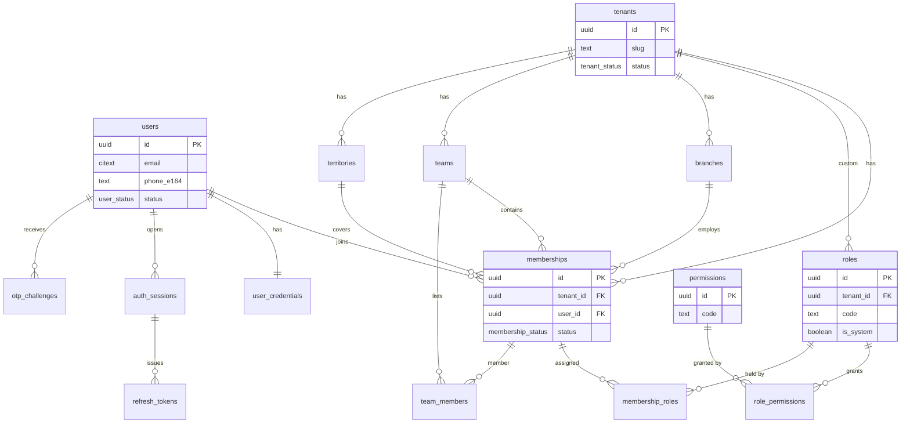
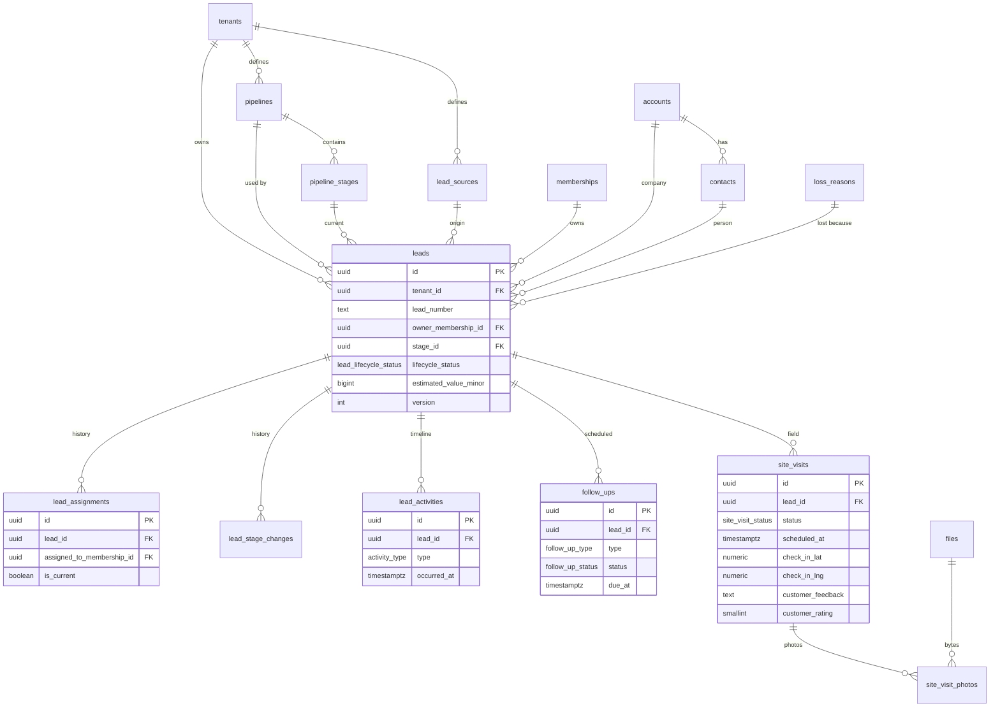
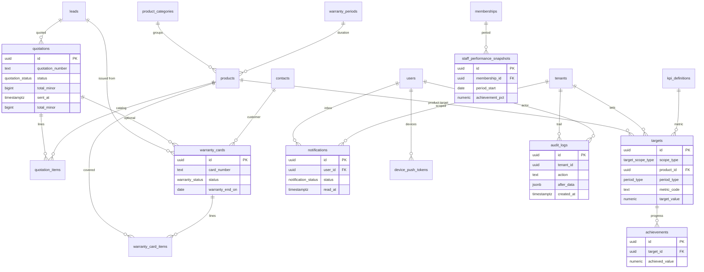
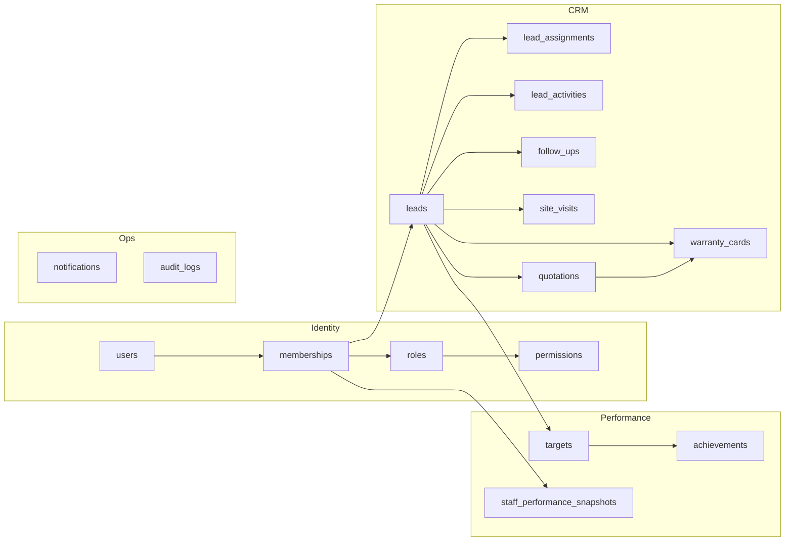

# INTRA LEADS

# Logical Data Model and Physical Schema Specification

| Field | Value |
| --- | --- |
| Product | INTRA LEADS |
| Document type | Logical + physical data model |
| Database | PostgreSQL 17 |
| Tenancy | Shared schema, `tenant_id` on every tenant-owned row |
| Identifiers | UUID v7 (time-sortable) |
| Version | 1.0.0 |
| Date | 15 August 2026 |
| Companion SQL | `docs/data/sql/` |

This document is the data-architecture companion to the Software Architecture Document. The runnable source of truth for columns, constraints, and indexes is the SQL in `docs/data/sql/intra_leads_schema.sql`.

---

## 1. Design principles

1. **Tenant is a data dimension.** Every tenant-owned table has `tenant_id NOT NULL`. Platform tables (`tenants`, `users`, `permissions`) do not.
2. **UUID v7 primary keys.** Time-sortable identifiers reduce B-tree page splits on insert-heavy tables.
3. **Soft delete by default** for CRM and directory records. Auth secrets, OTPs, audit rows, and outbox rows use explicit hard-delete or append-only rules.
4. **Audit fields on every mutable business table.** Who created, who changed, who deleted, and a monotonic `version`.
5. **Uniqueness is partial.** Unique indexes apply only to live rows (`deleted_at IS NULL`) unless the table is append-only.
6. **Indexes start with `tenant_id`** for tenant-scoped access paths.
7. **Money is integer minor units** plus ISO-4217 `currency`. No `numeric` money in operational tables except KPI targets that are unit-agnostic.
8. **Lookups are data, not enums, when tenants configure them.** Pipeline stages and lead sources are tables. Stable machine states are PostgreSQL enums.
9. **History is first-class.** Assignments, stage changes, and quotation status changes are stored as rows, not overwritten.
10. **RLS-ready.** Policies can be enabled without a remodel. See `intra_leads_rls.sql`.

---

## 2. Module-to-table map

| Module | Tables |
| --- | --- |
| Platform / tenancy | `tenants`, `tenant_sequences`, `files` |
| Authentication | `user_credentials`, `auth_sessions`, `refresh_tokens`, `otp_challenges` |
| Users | `users`, `memberships` |
| Roles | `roles`, `membership_roles` |
| Permissions | `permissions`, `role_permissions` |
| Organization (supporting) | `branches`, `teams`, `team_members`, `territories` |
| Leads | `lead_sources`, `lead_qualities`, `pipelines`, `pipeline_stages`, `loss_reasons`, `accounts`, `contacts`, `leads`, `lead_stage_changes` |
| Lead Assignments | `lead_assignments` |
| Lead Activities | `lead_activities` |
| Follow-ups | `follow_ups` |
| Comms | `message_templates`, `outbound_messages` |
| Billing | `billing_customers`, `billing_invoices`, `billing_payments`, `billing_sync_jobs` |
| Site Visits | `site_visits` |
| Quotations | `quotations`, `quotation_items`, `product_categories`, `products` |
| Warranty Cards | `warranty_cards`, `warranty_card_items`, `warranty_periods` |
| Targets | `kpi_definitions`, `targets` |
| Achievements | `achievements` |
| Staff Performance | `staff_performance_snapshots` |
| Dashboard | Live-only |
| Analytics | Live-only (leads, stage changes, quotations) |
| Notifications | `notifications`, `notification_preferences`, `device_push_tokens` |
| Audit Logs | `audit_logs` (range-partitioned) |
| Platform reliability | `domain_outbox`, `idempotency_keys` |

`accounts` and `contacts` are included because leads, quotations, and warranty cards cannot be production-grade without a customer master.

---

## 3. ER diagrams

### 3.1 Identity, roles, and tenancy



### 3.2 Lead core



### 3.3 Commercial, performance, notifications, warranty, audit



### 3.4 High-level relationship map



---

## 4. Table definitions

Audit columns are documented once in Section 7 and omitted from the summaries below unless a table diverges.

### 4.1 `tenants` — platform

| Column | Type | Notes |
| --- | --- | --- |
| `id` | uuid PK | UUID v7 |
| `slug` | text | Unique live slug, lowercase |
| `name` | text | Display name |
| `status` | `tenant_status` | `provisioning`, `active`, `suspended`, `offboarding`, `closed` |
| `timezone` | text | IANA, default `Asia/Kolkata` |
| `locale` | text | Default `en-IN` |
| `currency` | char(3) | Default `INR` |
| `settings` | jsonb | Feature flags and limits |

### 4.2 Authentication

**`users`** — global identity. A person may hold many tenant memberships.

| Column | Type | Notes |
| --- | --- | --- |
| `email` | citext | Unique among live users when present |
| `phone_e164` | text | Unique among live users when present |
| `full_name` | text | |
| `status` | `user_status` | `active`, `invited`, `locked`, `disabled` |
| `is_platform_admin` | boolean | Control-plane only |
| `email_verified_at` / `phone_verified_at` | timestamptz | |
| `last_login_at` | timestamptz | |

**`user_credentials`** — one row per user. Password hash never appears in `users` or logs.

| Column | Type | Notes |
| --- | --- | --- |
| `user_id` | uuid PK/FK | |
| `password_hash` | text | Argon2id |
| `password_algo` | text | `argon2id` |
| `failed_attempts` | int | |
| `locked_until` | timestamptz | |

**`auth_sessions`** — device-bound session. Revoke, do not soft-delete.

| Column | Type | Notes |
| --- | --- | --- |
| `user_id` | uuid FK | |
| `tenant_id` | uuid FK | Selected tenant; nullable until chosen |
| `device_id` | text | Required from mobile |
| `refresh_family_id` | uuid | Reuse detection |
| `status` | `auth_session_status` | `active`, `revoked`, `expired` |
| `expires_at` | timestamptz | |

**`refresh_tokens`** — hashed rotating tokens. Reuse of a family revokes the family.

**`otp_challenges`** — hashed OTP, purpose-scoped (`login`, `password_reset`, `step_up`, `verify_email`, `verify_phone`). Hard-deleted by TTL job.

### 4.3 Users, roles, permissions

**`permissions`** — global catalog. Code format `resource:action` (`lead:assign`).

**`roles`** — `tenant_id IS NULL` for system roles (`tenant.admin`, `sales.manager`, `sales.executive`, `sales.viewer`, `api.integration`). Tenant-defined roles set `tenant_id`.

**`role_permissions`** — M:N role to permission.

**`memberships`** — the only way a user acts inside a tenant. Leads, visits, quotations, and targets hang off `memberships`, not raw `users`, so territory and team scope stay correct.

**`membership_roles`** — M:N membership to role.

**`branches` / `teams` / `territories` / `team_members`** — assignment and target scope.

### 4.4 Leads

**`lead_sources`**, **`lead_qualities`**, **`pipelines`**, **`pipeline_stages`**, **`loss_reasons`** — tenant-configurable catalogs. Stages carry `win_probability_bps`, `sort_order`, and flags `is_won` / `is_lost` / `is_open`. `leads.quality` stores the `lead_qualities.code` (text), not an enum.

**`product_categories`**, **`products`**, **`warranty_periods`** — tenant product catalog. Categories have `code`, optional `parent_id`, and `sort_order`. Warranty periods have unique live `(tenant_id, months)` and copy `months` onto `products.warranty_months` when linked.

**`accounts`** — organizations. **`contacts`** — people, optional `account_id`.

**`leads`** — aggregate root.

| Column | Type | Notes |
| --- | --- | --- |
| `lead_number` | text | Unique per tenant among live rows; from `tenant_sequences` |
| `title` | text | Working name |
| `contact_id` / `account_id` | uuid | Optional links |
| `primary_phone` / `primary_email` | text | Denormalized for field capture |
| `source_id` | uuid | |
| `quality` | text | `lead_qualities.code`; tenant-managed |
| `pipeline_id` / `stage_id` | uuid | Stage must belong to pipeline |
| `owner_membership_id` | uuid | Current owner; null = pool |
| `lifecycle_status` | `lead_lifecycle_status` | `open`, `won`, `lost`, `unqualified`, `recycled` |
| `score` | int | 0–100 |
| `estimated_value_minor` | bigint | |
| `currency` | char(3) | |
| `expected_close_on` | date | |
| `lost_reason_id` | uuid | Required when lost |
| `first_assigned_at` / `last_activity_at` | timestamptz | |
| `custom_fields` | jsonb | Schema-registry validated in app |
| `geo` | point | Optional |
| `version` | int | Optimistic concurrency |

**`lead_assignments`** — full assignment history. Exactly one `is_current = true` live row per lead.

**`lead_stage_changes`** — stage/lifecycle history for funnel and SLA analytics.

**`lead_activities`** — notes, calls, meetings, email, SMS, WhatsApp, system events. `occurred_at` is the business time; `created_at` is the write time.

**`message_templates`** — tenant SMS and WhatsApp bodies with `{{customer_name}}`, `{{lead_title}}`, `{{lead_number}}`, `{{staff_name}}`, `{{city}}`.

**`outbound_messages`** — one row per click-to-call, WhatsApp, or SMS attempt. `mode` is `device` (open the phone dialer / WhatsApp / SMS app) or `sent` (Twilio or Meta Cloud API). Gateway failures fall back to a device launch URI so the salesperson can still reach the customer.

### 4.4a Billing integration

**`billing_customers`** — CRM customer projection for accounting. One live row per lead. CRM owns display name, phone, and email; `external_id` is the accounting key.

**`billing_invoices`** — invoices mirrored from accounting, usually created when a quotation is won. `payment_status` is `unpaid`, `partial`, `paid`, `overdue`, `void`, or `refunded`. Accounting owns invoice number, totals, and balance.

**`billing_payments`** — inbound payment events. Unique on `(tenant_id, provider, external_id)` for live rows. CRM does not post collections.

**`billing_sync_jobs`** — append-only attempt log (`customer` / `invoice` / `payment`, `outbound` / `inbound`).

Service layer: `CustomerSyncService`, `InvoiceSyncService`, `PaymentStatusService` behind `BillingGateway` (`manual` or `http`).

### 4.5 Follow-ups and site visits

**`follow_ups`**

| Column | Type | Notes |
| --- | --- | --- |
| `type` | `follow_up_type` | `call`, `whatsapp`, `visit`, `meeting` |
| `due_at` | timestamptz | SLA clock |
| `remind_at` | timestamptz | Optional |
| `status` | `follow_up_status` | `pending`, `completed`, `cancelled`, `skipped` |
| `assigned_to_membership_id` | uuid | |
| `reschedule_count` | int | Times `due_at` was moved |
| `completed_activity_id` | uuid | Set when completed |

Overdue is **not** stored. It is `status = pending AND due_at < now()`. A partial index supports that query.

**`site_visits`**

| Column | Type | Notes |
| --- | --- | --- |
| `scheduled_at` | timestamptz | |
| `checked_in_at` / `checked_out_at` | timestamptz | |
| `check_in_lat` / `check_in_lng` | numeric(9,6) | GPS at check-in; `check_in_geo` is synced |
| `check_out_lat` / `check_out_lng` | numeric(9,6) | GPS at check-out; `check_out_geo` is synced |
| `status` | `site_visit_status` | `scheduled`, `in_progress`, `completed`, `cancelled`, `no_show` |
| `notes` | text | Staff notes |
| `outcome` | text | Completion outcome |
| `customer_feedback` | text | Customer comments |
| `customer_rating` | smallint | Optional 1–5 |

**`site_visit_photos`** — field photos. Bytes live in `files` (`resource_type = 'site_visit'`). Optional capture GPS.

### 4.6 Quotations

**`quotations`** — commercial offer against a lead.

| Column | Type | Notes |
| --- | --- | --- |
| `quotation_number` | text | Unique per tenant among live rows |
| `status` | `quotation_status` | `draft`, `sent`, `follow_up`, `customer_deciding`, `negotiation`, `approved`, `won`, `lost` |
| `subtotal_minor` / `discount_minor` / `tax_minor` / `total_minor` | bigint | |
| `assigned_to_membership_id` | uuid | Optional owner; defaults to lead owner |
| `follow_up_at` / `customer_deciding_at` / `negotiation_at` / `approved_at` / `won_at` / `lost_at` | timestamptz | Stage clocks |
| `lost_reason` | text | Required when status is `lost` |
| `next_follow_up_at` | timestamptz | Next reminder due. Overdue is computed. |
| `remind_at` | timestamptz | Optional early ping before `next_follow_up_at` |
| `expected_close_on` | date | Sales-expected closing date |
| `last_followed_up_at` | timestamptz | Last logged quotation follow-up |
| `follow_up_note` | text | Latest reminder note |

Pending quotations are **not** a table. They are live rows whose status is `sent`, `follow_up`, `customer_deciding`, `negotiation`, or `approved`. Closing prediction is computed from stage, reminder health, and expected close.

**`quotation_items`** — line items. `product_id` optional for free-text lines. Amounts stored on the line; header totals are maintained by the application in the same transaction.

**`quotation_follow_up_events`** — idempotent reminder / closing-soon notifications (same pattern as `follow_up_engine_events`).

### 4.7 Targets, achievements, staff performance

**`kpi_definitions`** — platform catalog including operational KPIs (`revenue`, `leads_won`, …) and staff performance rates (`lead_conversion`, `follow_up_completion`, `sales_achievement`, `quotation_conversion`).

**`targets`** — one live target per tenant + scope + product + metric + period. Product is orthogonal to scope (a team can have a product monthly target). Progress is **computed live** from leads, visits, follow-ups, and won quotations — not stored as the scoreboard.

Achievement fields (computed, not stored):

| Field | Formula |
| --- | --- |
| Achievement % | `achieved / target` (basis points, not capped — can exceed 100%) |
| Balance | `target − achieved` (negative = surplus) |
| Daily requirement | `max(0, balance) / days remaining including today` (`null` after period end) |
| Forecast | `(achieved / days elapsed) × days in period` — band: hit / ahead / on track / at risk / behind / missed |

| Column | Type | Notes |
| --- | --- | --- |
| `scope_type` | `target_scope_type` | `tenant`, `branch`, `team`, `membership` |
| `scope_id` | uuid | Null only when scope is tenant |
| `product_id` | uuid | Optional product dimension |
| `period_type` | `period_type` | `daily`, `monthly`, `quarterly`, `yearly`, `custom` |
| `period_start` / `period_end` | date | Inclusive. Daily requires `period_start = period_end` |
| `metric_code` | text | FK-equivalent to `kpi_definitions.code` |
| `target_value` | numeric(18,4) | Unit depends on KPI (`revenue` is minor currency / paise) |

**`achievements`** — optional manual or job-computed increments. The Target module UI uses live queries, not this table, as the primary scoreboard.

**`staff_performance_snapshots`** — optional job cache of raw period counts (one row per membership per period). The Staff Performance module **computes live**:

| KPI | Formula |
| --- | --- |
| Lead conversion | `won / (won + lost)` in period; if none decided, `won / created` |
| Follow-up completion | `completed / due` among follow-ups due in the period (cancelled excluded) |
| Sales achievement | won quotation revenue vs membership `revenue` target (uncapped %) |
| Quotation conversion | `won / (won + lost)` in period; if none decided, `won / sent` |

**Performance score** is the equal-weight average of present KPIs (25% each; null KPIs are skipped and weights renormalized). **Ranking** is dense by score, then sales achievement, then revenue. Leaderboards are slices of that ranked list (overall, per KPI, per team).

**Founder dashboard** is live-only (no table). `GET /dashboard` aggregates today's leads, follow-ups, quotations, orders (won quotations), sales (won quotation revenue vs company monthly `revenue` target), and staff performance. Charts are 7-day series plus mix slices. Access is `dashboard:read`.

**Sales staff dashboard** is the same live scoreboard scoped to the signed-in membership (`GET /dashboard/me`). It returns personal KPIs (lead conversion, follow-up completion, sales achievement, quotation conversion), current membership/team target tracking, and personal performance widgets. Access is `dashboard:self`.

**Analytics dashboards** are live-only (no table). They score the sales funnel:

| Metric | Formula |
| --- | --- |
| Leads | Leads created in the period |
| Qualified | Unique leads whose first arrival at Qualified or a later non-lost stage falls in the period. The Qualified stage is the pipeline stage named/coded `qualified`, otherwise the first open stage with win probability ≥ 40% |
| Quotations | Quotations created in the period |
| Won | Quotations marked won in the period |
| Conversion | `won / leads`, plus step rates lead→qualified, qualified→quoted leads, quotation→won |

`GET /analytics` is the company funnel dashboard (`dashboard:read`). `GET /analytics/me` is the same board scoped to the signed-in membership (`dashboard:self`). Widget detail is `GET /analytics/:metricCode`. Charts are 7-day series plus mix slices. The report copy is `GET /reports/analytics` and `GET /reports/analytics/export`.

**Funnel report** is live-only. It collapses tenant pipelines onto five canonical stages: Lead, Qualified, Quotation, Negotiation, Won. Reached counts are monotonic (a won lead also counts as having reached Lead through Negotiation). Current counts are leads sitting in that band now. Charts: pyramid (reached), conversion bars, current-stage bars, and a 7-day grouped trend. Access is `GET /analytics/funnel` / `GET /reports/funnel` (`dashboard:read`) and `GET /analytics/funnel/me` (`dashboard:self`).

### Search

Live lookup stays on PostgreSQL. OpenSearch is not in v1.

`GET /search?q=&by=` classifies the query, then hits one field’s index. `by` is optional Auto, or one of Customer, Mobile, Lead ID, Quotation Number.

| Field | Classify | Hot path |
| --- | --- | --- |
| Customer | free text | GIN trigram on `customer_name` |
| Mobile | 10-digit / E.164 | btree `(tenant_id, primary_phone)` then trigram fallback |
| Lead ID | `LD-…` or UUID | unique `lead_number` prefix / exact `id` |
| Quotation Number | `QT-…` | unique `quotation_number` prefix |

Document numbers are normalized (`ld2026000123` → `LD-2026-000123`) so prefix scans stay btree-friendly (no leading `%`). Results are capped at 50 and cached in Redis for 20s per tenant + plan. Access is `lead:read` and/or `quotation:read`.

### 4.8 Notifications

**`notifications`** — in-app inbox is the source of truth. FCM is delivery via queue `intra.notifications`.

Product events:

| Event | Code | When |
| --- | --- | --- |
| Lead Assigned | `lead.assigned` | Lead created/assigned to another user |
| Follow-up Due | `follow_up.due_today` | Follow-up engine, due today |
| Follow-up Overdue | `follow_up.overdue` | Follow-up engine, past due |
| Quotation Pending | `quotation.pending` | Quotation sent, then daily while pending |

`GET /notifications/catalog` and `GET/PUT /notifications/preferences` expose those four. Device tokens register at `POST /notifications/devices` and revoke on logout.

**`notification_preferences`** — per user, tenant, and event type (`inAppEnabled`, `pushEnabled`). Missing row means both channels on.

**`device_push_tokens`** — FCM token per user + device. Revoke on logout and when FCM reports an invalid token.

**`follow_up_engine_events`** — idempotent follow-up engine sends (overdue, due today, upcoming, escalation, no follow-up). Live buckets stay computed from `due_at`.

### 4.9 Warranty cards

**`warranty_cards`** — issued after sale / accepted quotation. Card numbers use `app.next_document_number(..., 'warranty')` (`WR-YYYY-######`). QR, PDF, and the public verification URL are generated live from the card; bytes are not stored.

| Column | Type | Notes |
| --- | --- | --- |
| `card_number` | text | Unique per tenant among live rows |
| `serial_number` | text | Unique per tenant among live rows when present |
| `verify_token` | text | Unguessable public token; unique among live rows |
| `purchased_on` / `warranty_start_on` / `warranty_end_on` | date | |
| `status` | `warranty_status` | `active`, `expired`, `claimed`, `void`. Expiry is also applied live when `warranty_end_on` is past |

**`warranty_card_items`** — covered products when a card spans more than one SKU.

Public verification portal is unauthenticated:

- `GET /public/warranty` — scan QR, upload QR photo, or paste URL/token
- `GET /public/warranty/:token` — JSON verify
- `GET /public/warranty/:token/view` — HTML result
- `GET /public/warranty/:token/pdf` — downloadable PDF

QR codes on issued cards encode the HTML result URL. Access inside the app is `warranty:create` / `warranty:read` / `warranty:update`.

Operational reports are computed from live rows. There is no report table.

- `GET /reports/leads` — lifecycle, source, owner, stage (`lead:read`)
- `GET /reports/follow-ups` — status, type, overdue/today buckets (`follow_up:read`)
- `GET /reports/quotations` — quotation pipeline value (`quotation:read`)
- `GET /reports/sales` — won quotation revenue (`quotation:read`)
- `GET /reports/performance` — staff scores and leaderboard (`performance:read`)
- `GET /reports/analytics` — funnel: leads, qualified, quotations, won, conversion (`dashboard:read`)
- `GET /reports/analytics/me` — personal funnel dashboard (`dashboard:self`)
- `GET /reports/funnel` — five-stage funnel: Lead, Qualified, Quotation, Negotiation, Won (`dashboard:read`)
- `GET /reports/funnel/me` — personal five-stage funnel (`dashboard:self`)

Each report can be downloaded as Excel, PDF, or CSV:

- `GET /reports/leads/export?format=xlsx|pdf|csv`
- `GET /reports/follow-ups/export?format=xlsx|pdf|csv`
- `GET /reports/quotations/export?format=xlsx|pdf|csv`
- `GET /reports/sales/export?format=xlsx|pdf|csv`
- `GET /reports/performance/export?format=xlsx|pdf|csv`
- `GET /reports/analytics/export?format=xlsx|pdf|csv`
- `GET /reports/funnel/export?format=xlsx|pdf|csv`

Bytes are generated live. There is no export table.

### 4.10 Files, sequences, reliability, audit

**`files`** — object metadata only. Bytes live in S3 under `tenants/{tenant_id}/...`.

**`tenant_sequences`** — per-tenant counters for `lead`, `quotation`, `warranty`.

**`domain_outbox`** — transactional events. Relayed by workers.

**`idempotency_keys`** — 24h+ replay cache for mobile retries.

**`audit_logs`** — append-only, **partitioned by `created_at` (monthly)**. No `updated_at`, no `deleted_at`, no application UPDATE/DELETE grants.

Product name **Track**. Application writes these `action` values:

| Track | `action` | When |
| --- | --- | --- |
| Create | `create` | Lead, quotation, or follow-up created |
| Update | `update` | Record edited (including follow-up reschedule) |
| Delete | `delete` | Soft-delete of a lead or draft quotation |
| Assignments | `assign` | Owner / assignee changed |
| Status Changes | `status_change` | Lead stage, quotation status, or follow-up complete |

`resource_type` is `lead`, `quotation`, or `follow_up`. `before_data` / `after_data` hold `{ summary, number?, from?, to?, fields? }`.

Endpoints (`audit:read`):

- `GET /tracks` — cursor list (`action`, `resourceType`, `resourceId`, `from`, `to`)
- `GET /tracks/catalog` — the five actions
- `GET /leads/:leadId/tracks` — scoped list
- `GET /leads/:leadId/assignments` — `lead_assignments` history (`lead:read`)
- `GET /reports/tracks` and `GET /reports/tracks/export`

Soft-delete: `DELETE /leads/:leadId` (`lead:update`), `DELETE /quotations/:quotationId` for drafts (`quotation:create`).

The lead activity timeline stays on `lead_activities`. Track is the compliance change log.

---

## 5. Foreign keys

All FKs use `ON UPDATE RESTRICT`. Delete behavior:

| Parent | Child | On delete | Reason |
| --- | --- | --- | --- |
| `tenants` | Almost all tenant tables | `RESTRICT` | Soft-close the tenant; never cascade-wipe |
| `users` | `memberships`, sessions, credentials | `RESTRICT` | Soft-disable the user |
| `memberships` | `leads.owner_membership_id` | `RESTRICT` | Reassign before removing membership |
| `leads` | assignments, activities, follow-ups, visits, quotations, stage changes | `RESTRICT` | Soft-delete the lead; children remain for history |
| `pipelines` | `pipeline_stages`, `leads` | `RESTRICT` | |
| `pipeline_stages` | `leads.stage_id` | `RESTRICT` | |
| `quotations` | `quotation_items` | `CASCADE` | Items have no independent lifecycle |
| `warranty_cards` | `warranty_card_items` | `CASCADE` | |
| `targets` | `achievements` | `RESTRICT` | Keep achievement history |
| `auth_sessions` | `refresh_tokens` | `CASCADE` | Session revoke cleans tokens |
| `roles` | `role_permissions`, `membership_roles` | `CASCADE` | Junction only |
| `permissions` | `role_permissions` | `RESTRICT` | Catalog is durable |

Composite integrity that PostgreSQL FKs cannot express is enforced by triggers in the schema script:

- `leads.stage_id` must belong to `leads.pipeline_id` and the same tenant
- `leads.owner_membership_id` must belong to the same tenant
- `targets.scope_id` must reference the table implied by `scope_type`
- `targets.product_id` when set must belong to the same tenant
- Child `tenant_id` must equal parent `tenant_id` (same-tenant trigger)

---

## 6. Indexes

Naming: `idx_{table}_{columns}`, `uq_{table}_{columns}`, `pk_{table}`.

### 6.1 Uniqueness (live rows)

| Index | Expression / predicate |
| --- | --- |
| `uq_tenants_slug` | `lower(slug) WHERE deleted_at IS NULL` |
| `uq_users_email` | `lower(email) WHERE deleted_at IS NULL AND email IS NOT NULL` |
| `uq_users_phone` | `phone_e164 WHERE deleted_at IS NULL AND phone_e164 IS NOT NULL` |
| `uq_memberships_tenant_user` | `(tenant_id, user_id) WHERE deleted_at IS NULL` |
| `uq_roles_tenant_code` | `(tenant_id, code) WHERE deleted_at IS NULL` (NULL tenant treated as system via unique index on `code` where `tenant_id IS NULL`) |
| `uq_leads_tenant_number` | `(tenant_id, lead_number) WHERE deleted_at IS NULL` |
| `uq_lead_assignments_current` | `(lead_id) WHERE is_current AND deleted_at IS NULL` |
| `uq_quotations_tenant_number` | `(tenant_id, quotation_number) WHERE deleted_at IS NULL` |
| `uq_warranty_cards_tenant_number` | `(tenant_id, card_number) WHERE deleted_at IS NULL` |
| `uq_warranty_cards_tenant_serial` | `(tenant_id, serial_number) WHERE deleted_at IS NULL AND serial_number IS NOT NULL` |
| `uq_warranty_cards_verify_token` | `(verify_token) WHERE deleted_at IS NULL` |
| `uq_targets_scope_metric_period` | `(tenant_id, scope_type, COALESCE(scope_id, zero-uuid), COALESCE(product_id, zero-uuid), metric_code, period_start, period_end) WHERE deleted_at IS NULL` |
| `uq_staff_perf_member_period` | `(tenant_id, membership_id, period_type, period_start) WHERE deleted_at IS NULL` |
| `uq_device_push_user_device` | `(user_id, device_id) WHERE revoked_at IS NULL` |
| `uq_notif_pref_user_event` | `(tenant_id, user_id, event_type) WHERE deleted_at IS NULL` |
| `uq_idempotency` | `(tenant_id, user_id, route, key)` |

### 6.2 Hot-path secondary indexes

| Access path | Index |
| --- | --- |
| Mobile lead list | `(tenant_id, lifecycle_status, updated_at DESC, id DESC) WHERE deleted_at IS NULL` |
| My leads | `(tenant_id, owner_membership_id, updated_at DESC) WHERE deleted_at IS NULL` |
| Lead delta sync | `(tenant_id, updated_at, id) WHERE deleted_at IS NULL` |
| Assignment inbox | `(tenant_id, assigned_to_membership_id, assigned_at DESC) WHERE is_current AND deleted_at IS NULL` |
| Activity timeline | `(tenant_id, lead_id, occurred_at DESC) WHERE deleted_at IS NULL` |
| Pending follow-ups | `(tenant_id, assigned_to_membership_id, due_at) WHERE status = 'pending' AND deleted_at IS NULL` |
| Overdue follow-ups | `(tenant_id, due_at) WHERE status = 'pending' AND deleted_at IS NULL` |
| Visit calendar | `(tenant_id, assigned_to_membership_id, scheduled_at) WHERE deleted_at IS NULL` |
| Quotation by lead | `(tenant_id, lead_id, created_at DESC) WHERE deleted_at IS NULL` |
| Search customer | GIN trigram on `leads.customer_name` |
| Search mobile | btree `(tenant_id, primary_phone)` then GIN trigram fallback |
| Search lead id | unique `(tenant_id, lead_number)` prefix / GIN trigram for fragments |
| Search quotation number | unique `(tenant_id, quotation_number)` prefix / GIN trigram for fragments |
| Warranty expiry job | `(tenant_id, warranty_end_on) WHERE status = 'active' AND deleted_at IS NULL` |
| Unread inbox | `(tenant_id, user_id, created_at DESC) WHERE read_at IS NULL AND deleted_at IS NULL` |
| Audit by resource | `(tenant_id, resource_type, resource_id, created_at DESC)` |
| Outbox relay | `(created_at) WHERE published_at IS NULL` |
| Session revoke | `(user_id, status)` and `(refresh_family_id)` |

---

## 7. Audit fields

Applied to every mutable business table unless noted.

| Column | Type | Rule |
| --- | --- | --- |
| `id` | uuid | `app.uuid_v7()` |
| `created_at` | timestamptz | `now()`, never updated |
| `updated_at` | timestamptz | Trigger-maintained |
| `created_by` | uuid | `users.id`, nullable for system jobs |
| `updated_by` | uuid | `users.id` |
| `deleted_at` | timestamptz | Null = live |
| `deleted_by` | uuid | Set with `deleted_at` |
| `version` | int | Starts at 1; increments on every live update |

**Divergent tables**

| Table | Pattern |
| --- | --- |
| `audit_logs` | `id`, `created_at` only. Append-only. |
| `domain_outbox` | `created_at`, `published_at`. No soft delete. |
| `refresh_tokens` / `otp_challenges` | Created + consumed/revoked timestamps. Hard-deleted by TTL. |
| `idempotency_keys` | `created_at`, `expires_at`. Hard-deleted by TTL. |
| `lead_assignments` / `lead_stage_changes` | Full audit fields; rows are historical, rarely deleted. |
| `staff_performance_snapshots` | `computed_at` plus standard audit; rewrite in place per period. |

Application writes must set `created_by` / `updated_by` from the authenticated user. Database triggers do not guess identity.

---

## 8. Soft-delete strategy

### 8.1 Policy

| Class | Strategy | Examples |
| --- | --- | --- |
| CRM / directory | Soft delete | leads, contacts, quotations, memberships, roles |
| Current-state flags | Soft delete + partial unique | current assignment, live lead number |
| Secrets / challenges | Hard delete after revoke or TTL | OTP, refresh tokens, idempotency |
| Compliance trail | No delete | `audit_logs` |
| Queue | Mark processed, then TTL hard delete | `domain_outbox` |
| Inbox | Soft delete (user dismiss) + partition drop | `notifications` |

### 8.2 Rules

1. A soft-deleted parent remains `RESTRICT`ed. Children are not cascade-soft-deleted by the database. The application decides whether to hide children via the parent or to soft-delete them in the same transaction.
2. All default list queries include `deleted_at IS NULL`.
3. Unique business keys are partial on `deleted_at IS NULL`, so a number or email can be reused only after an explicit product decision. **Lead, quotation, and warranty numbers are not reused** — the application keeps the row and the unique value.
4. Restore is an update: `deleted_at = NULL`, `deleted_by = NULL`, `version = version + 1`. Restore is audited.
5. Hard delete is a compliance action (tenant offboarding), performed by a job, never by a user API.
6. Foreign keys still see soft-deleted rows. That is intentional: history must not dangle.

### 8.3 Application contract

```text
Live read     : WHERE tenant_id = $1 AND deleted_at IS NULL
Get by id     : same predicate (404 if deleted or other tenant)
Delete        : SET deleted_at = now(), deleted_by = $user, version = version + 1
Restore       : SET deleted_at = NULL, deleted_by = NULL, version = version + 1
```

Prisma / repository layers must apply the live predicate by default. An explicit `includeDeleted` is required to read tombstones.

---

## 9. Performance optimization

### 9.1 Access-path design

The mobile app’s dominant queries are tenant-scoped lists:

- my open leads
- delta sync since `updated_at`
- pending follow-ups
- unread notifications
- visit calendar

Every one of those has a **partial, tenant-leading, ordered** index. Random UUID v4 inserts are avoided via UUID v7.

### 9.2 Partitioning

| Table | Method | Why |
| --- | --- | --- |
| `audit_logs` | `RANGE (created_at)` monthly | High write, time-based retention |
| `notifications` | `RANGE (created_at)` monthly | High write, drop old partitions |
| `domain_outbox` | no partition at v1 | Relayed and pruned; partition if backlog grows |

`intra_leads_partitions.sql` creates the current month, the next three months, and a function `app.ensure_monthly_partitions()` for the scheduler.

Primary key on partitioned tables is `(id, created_at)` because PostgreSQL requires the partition key in the unique key. Application still treats `id` as the identifier. A unique index on `id` alone is not used across partitions.

### 9.3 Fillfactor and HOT updates

Tables with frequent `updated_at` / `version` / `last_activity_at` changes use `fillfactor = 90`:

- `leads`
- `follow_ups`
- `notifications` (read receipts)
- `memberships`

This encourages heap-only tuple updates when indexed columns are untouched.

### 9.4 What is intentionally not indexed

- `custom_fields` jsonb wholesale GIN — add expression indexes only for tenant fields that are actually filtered
- Full-text on activity notes — add `tsvector` later if note search is required
- Geospatial GiST on `leads.geo` — add when proximity search ships

### 9.5 Aggregation strategy

Staff performance is **not** computed with triggers on `leads`. Triggers would serialize lead writes.

Nightly / hourly job:

1. Read closed period activity from covering indexes
2. Upsert `staff_performance_snapshots`
3. Insert `achievements` rows for computed deltas when required

### 9.6 Connection and planning

- Prepared statements via Prisma
- RDS Proxy when connection count becomes the limit
- `statement_timeout` at the role level (recommended 15s for API role, higher for worker)
- `idle_in_transaction_session_timeout` enabled
- Autovacuum scale-up on `leads`, `lead_activities`, `audit_logs`, `notifications`

### 9.7 Expected volume and storage notes

| Table | Write profile | Retention |
| --- | --- | --- |
| `leads` | Medium | Life of tenant |
| `lead_activities` | High | Life of tenant |
| `notifications` | High | 12 months, then drop partition |
| `audit_logs` | Highest | 24 months default, then drop or archive |
| `domain_outbox` | High | 7 days after publish |
| `idempotency_keys` | High | 24–72 hours |
| `otp_challenges` | Medium | 1 day |

---

## 10. Multi-tenant integrity

### 10.1 Same-tenant trigger

`app.assert_same_tenant(parent_tenant_id, child_tenant_id)` is called from BEFORE INSERT/UPDATE triggers on children of tenant-owned parents (`leads`, `quotations`, `follow_ups`, and others). A cross-tenant FK is a hard error.

### 10.2 RLS readiness

Session GUC: `app.tenant_id`.

Policies (optional enablement in `intra_leads_rls.sql`):

```sql
USING (tenant_id = nullif(current_setting('app.tenant_id', true), '')::uuid)
```

Platform tables are granted only to the control-plane role. The API role should set `app.tenant_id` per request and should not bypass RLS except via a dedicated security-definer function for platform admin.

### 10.3 Isolation checklist (schema)

- [x] Tenant tables have `tenant_id NOT NULL`
- [x] Unique keys include `tenant_id` where uniqueness is per tenant
- [x] List indexes start with `tenant_id`
- [x] S3 key prefix stored as `storage_key` beginning with `tenants/{tenant_id}/`
- [x] Audit rows carry `tenant_id`
- [x] Outbox and idempotency rows carry `tenant_id`

---

## 11. Numbering

`tenant_sequences` holds `{ tenant_id, name, prefix, next_value }`.

| Name | Prefix example | Used by |
| --- | --- | --- |
| `lead` | `LD` | `leads.lead_number` → `LD-2026-000123` |
| `quotation` | `QT` | `quotations.quotation_number` |
| `warranty` | `WR` | `warranty_cards.card_number` |

`app.next_document_number(tenant_id, name)` locks the sequence row and returns the formatted number. Call it inside the same transaction as the insert.

---

## 12. SQL script map

| File | Purpose |
| --- | --- |
| `docs/data/sql/intra_leads_schema.sql` | Extensions, types, functions, tables, FKs, indexes, triggers, comments |
| `docs/data/sql/intra_leads_partitions.sql` | Monthly partitions + maintenance function |
| `docs/data/sql/intra_leads_rls.sql` | RLS policies (enable when required) |
| `docs/data/sql/intra_leads_seed_rbac.sql` | System permissions and roles |
| `docs/data/sql/intra_leads_comms.sql` | Click-to-call, WhatsApp, SMS templates and outbound log |
| `docs/data/sql/intra_leads_billing.sql` | Customer sync, invoices, payment events, billing permissions |
| `docs/data/sql/intra_leads_catalog.sql` | Product categories `code`, `lead_qualities`, `warranty_periods`, `leads.quality` as text |
| `docs/data/sql/intra_leads_warranty.sql` | Warranty `verify_token` for QR / public URL |
| `docs/data/sql/intra_leads_search.sql` | Additive GIN trigram indexes for CRM search |
| `docs/data/sql/intra_leads_grants.sql` | API / worker / migrator roles |

Apply order:

```text
1. intra_leads_schema.sql
2. intra_leads_partitions.sql
3. intra_leads_seed_rbac.sql
4. intra_leads_grants.sql
5. intra_leads_search.sql       # if the database predates search indexes
6. intra_leads_rls.sql          # optional at launch
```

---

## 13. Out of scope for this schema version

- Dedicated schema-per-tenant physical isolation (ports remain compatible)
- OpenSearch / extra search tables (CRM lookup uses classified Postgres indexes)
- Full-text catalog of activity notes
- Multi-currency FX tables
- Warranty claim workflow beyond card status
- Payroll or HRIS

---

*End of Logical Data Model — INTRA LEADS v1.0.0*
